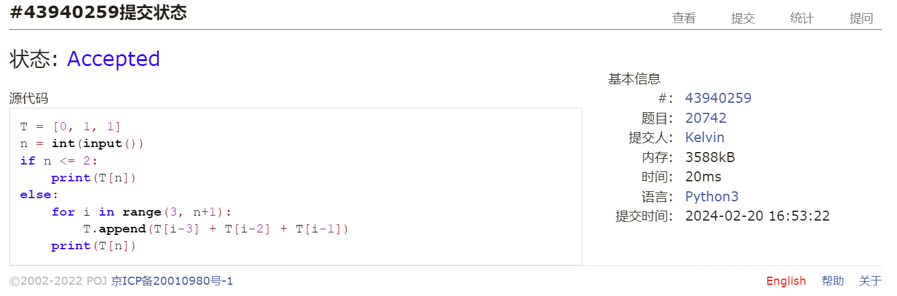
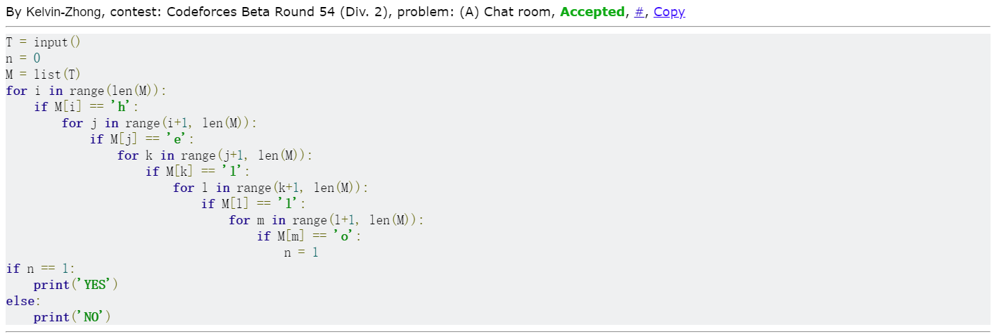
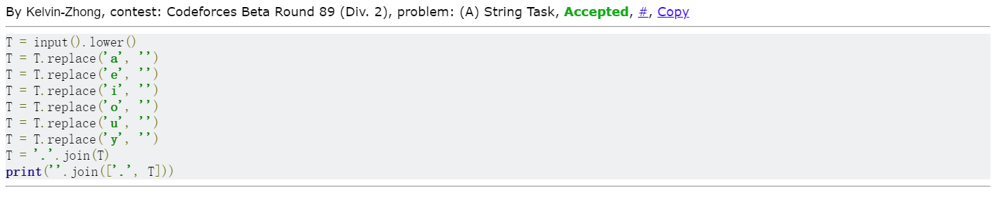
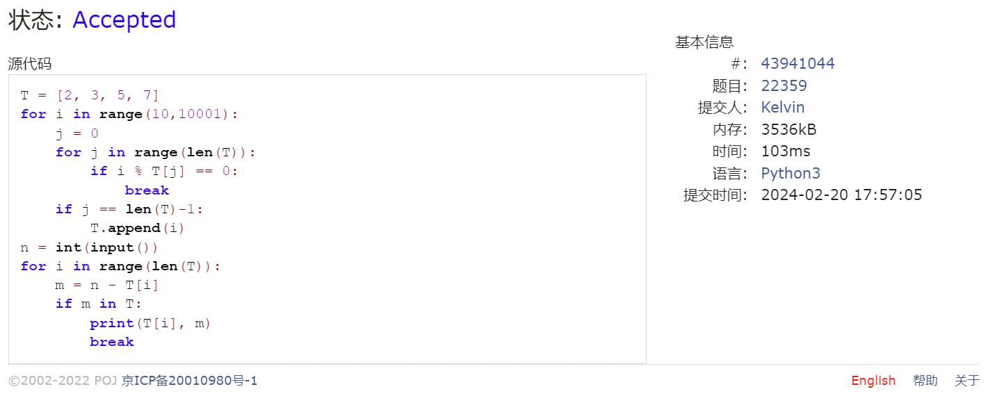
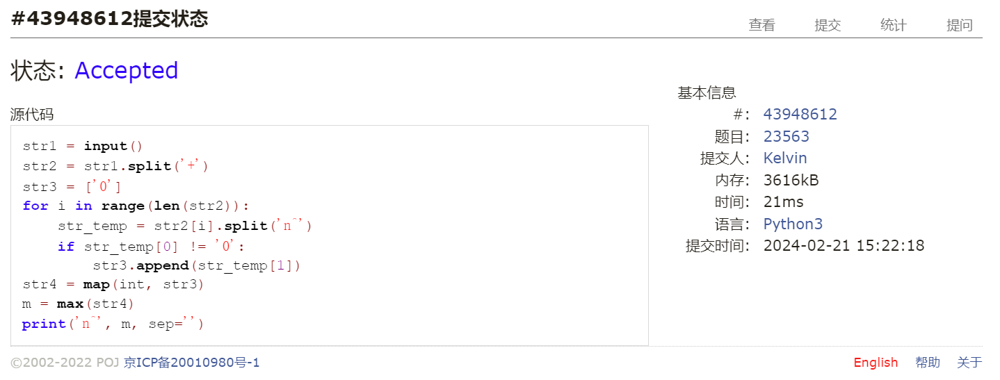
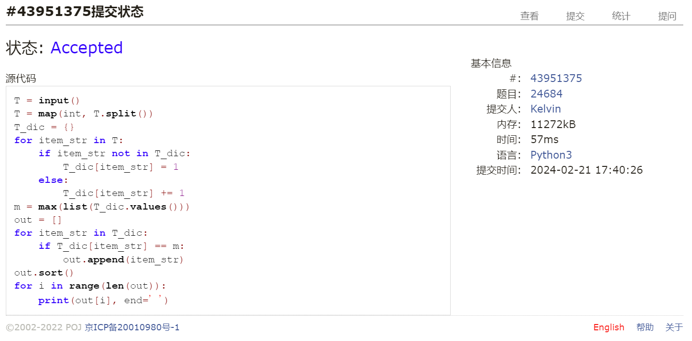

# Assignment #1: 拉齐大家Python水平

Updated GMT+8 March 10, 2024

2024 spring, Complied by 钟俊宇 物理学院

**编程环境**

==Windows 11 家庭中文版, PyCharm Community Edition 2023.3.3==


## 1. 题目

### 20742: 泰波拿契數

http://cs101.openjudge.cn/practice/20742/

思路：

逐项递推

##### 代码

```python
# 
T = [0, 1, 1]
n = int(input())
if n <= 2:
    print(T[n])
else:
    for i in range(3, n+1):
        T.append(T[i-3] + T[i-2] + T[i-1])
    print(T[n])

```

代码运行截图



### 58A. Chat room

greedy/strings, 1000, http://codeforces.com/problemset/problem/58/A

思路：

逐个字符寻找

##### 代码

```python
# 
T = input()
n = 0
M = list(T)
for i in range(len(M)):
    if M[i] == 'h':
        for j in range(i+1, len(M)):
            if M[j] == 'e':
                for k in range(j+1, len(M)):
                    if M[k] == 'l':
                        for l in range(k+1, len(M)):
                            if M[l] == 'l':
                                for m in range(l+1, len(M)):
                                    if M[m] == 'o':
                                        n = 1
if n == 1:
    print('YES')
else:
    print('NO')
```

代码运行截图



### 118A. String Task

implementation/strings, 1000, http://codeforces.com/problemset/problem/118/A

思路：

先将大写转为小写，然后将元音去掉，再以"."进行分隔

##### 代码

```python
# 
T = input().lower()
T = T.replace('a', '')
T = T.replace('e', '')
T = T.replace('i', '')
T = T.replace('o', '')
T = T.replace('u', '')
T = T.replace('y', '')
T = '.'.join(T)
print(''.join(['.', T]))

```

代码运行截图



### 22359: Goldbach Conjecture

http://cs101.openjudge.cn/practice/22359/

思路：

先寻找10000内质数，再对给出来的数进行拆分

##### 代码

```python
# 
T = [2, 3, 5, 7]
for i in range(10, 10001):
    j = 0
    for j in range(len(T)):
        if i % T[j] == 0:
            break
    if j == len(T)-1:
        T.append(i)
n = int(input())
for i in range(len(T)):
    m = n - T[i]
    if m in T:
        print(T[i], m)
        break
```

代码运行截图



### 23563: 多项式时间复杂度

http://cs101.openjudge.cn/practice/23563/

思路：

对字符串进行拆分，寻找系数不为零的最高次幂

##### 代码

```python
# 
str1 = input()
str2 = str1.split('+')
str3 = ['0']
for i in range(len(str2)):
    str_temp = str2[i].split('n^')
    if str_temp[0] != '0':
        str3.append(str_temp[1])
str4 = map(int, str3)
m = max(str4)
print('n^', m, sep='')
```

代码运行截图



### 24684: 直播计票

http://cs101.openjudge.cn/practice/24684/

思路：

使用字典，寻找value最大的key值

##### 代码

```python
# 
T = input()
T = map(int, T.split())
T_dic = {}
for item_str in T:
    if item_str not in T_dic:
        T_dic[item_str] = 1
    else:
        T_dic[item_str] += 1
m = max(list(T_dic.values()))
out = []
for item_str in T_dic:
    if T_dic[item_str] == m:
        out.append(item_str)
out.sort()
for i in range(len(out)):
    print(out[i], end=' ')
```

代码运行截图



## 2. 学习总结和收获

作业题目比较简单，复习了python的基本语法，回忆起了四年前学计概时的内容


