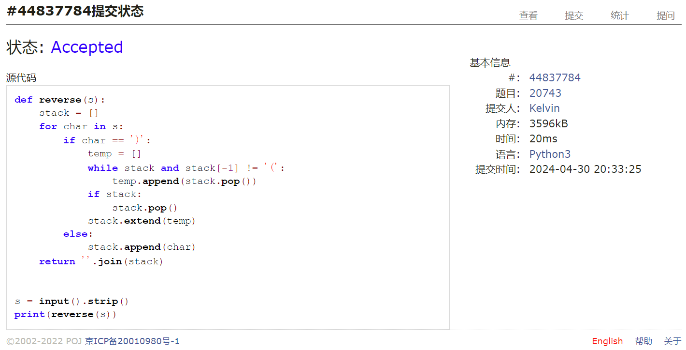
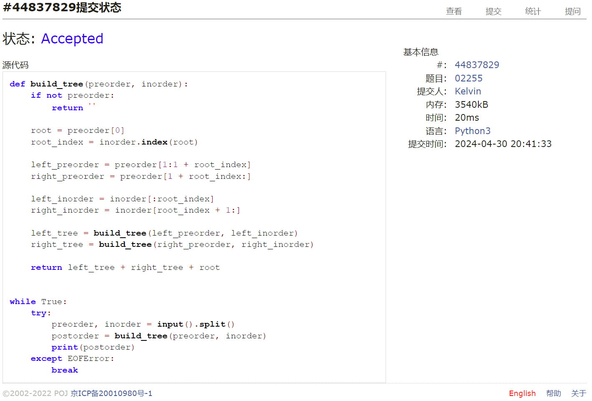
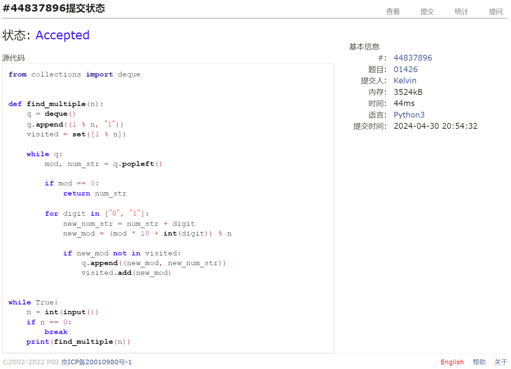
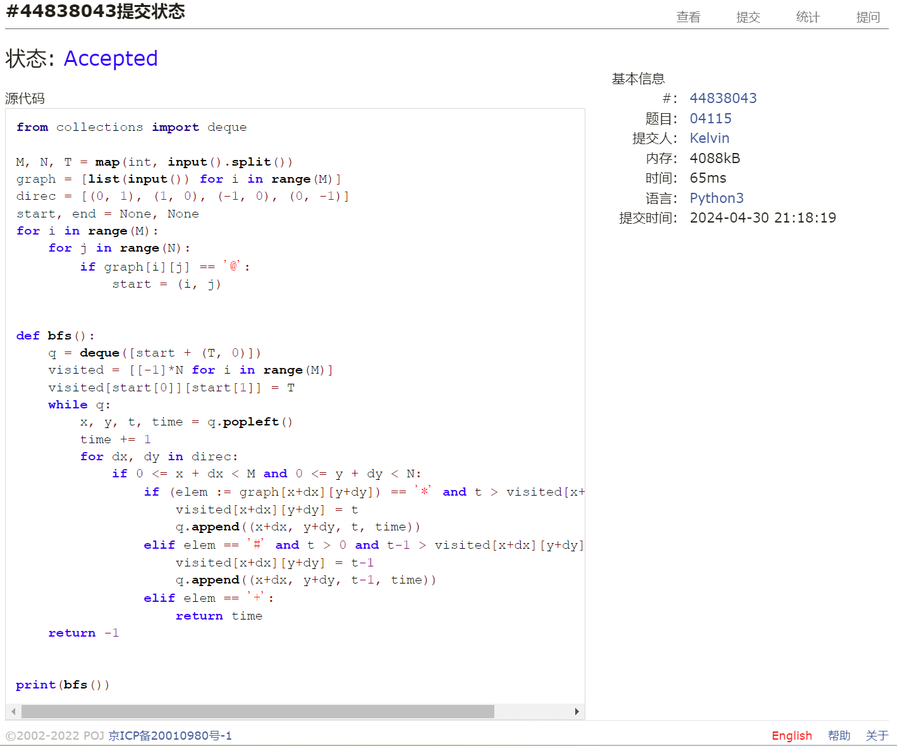

# Assignment #A: 图论：算法，树算及栈

Updated GMT+8 April 30, 2024

2024 spring, Complied by 钟俊宇 物理学院

**编程环境**

==Windows 11 家庭中文版, PyCharm Community Edition 2023.3.3==

## 1. 题目

### 20743: 整人的提词本

http://cs101.openjudge.cn/practice/20743/

思路：

遇到右括号则逐个pop至左括号，直至遍历完整个输入。

代码

```python
# 
def reverse(s):
    stack = []
    for char in s:
        if char == ')':
            temp = []
            while stack and stack[-1] != '(':
                temp.append(stack.pop())
            if stack:
                stack.pop()
            stack.extend(temp)
        else:
            stack.append(char)
    return ''.join(stack)


s = input().strip()
print(reverse(s))
```

代码运行截图 ==（至少包含有"Accepted"）==



### 02255: 重建二叉树

http://cs101.openjudge.cn/practice/02255/


思路：

根据前序表达式确定根，根据中序表达式确定左子树和右子树，可以递归的得到树的结构。

代码

```python
# 
def build_tree(preorder, inorder):
    if not preorder:
        return ''

    root = preorder[0]
    root_index = inorder.index(root)

    left_preorder = preorder[1:1 + root_index]
    right_preorder = preorder[1 + root_index:]

    left_inorder = inorder[:root_index]
    right_inorder = inorder[root_index + 1:]

    left_tree = build_tree(left_preorder, left_inorder)
    right_tree = build_tree(right_preorder, right_inorder)

    return left_tree + right_tree + root


while True:
    try:
        preorder, inorder = input().split()
        postorder = build_tree(preorder, inorder)
        print(postorder)
    except EOFError:
        break

```

代码运行截图 ==（至少包含有"Accepted"）==



### 01426: Find The Multiple

http://cs101.openjudge.cn/practice/01426/

要求用bfs实现

思路：

从字符串1开始，不断在后面添加字符0或1，并计算模值直至为0。

代码

```python
# 
from collections import deque


def find_multiple(n):
    q = deque()
    q.append((1 % n, "1"))
    visited = set([1 % n])

    while q:
        mod, num_str = q.popleft()

        if mod == 0:
            return num_str

        for digit in ["0", "1"]:
            new_num_str = num_str + digit
            new_mod = (mod * 10 + int(digit)) % n

            if new_mod not in visited:
                q.append((new_mod, new_num_str))
                visited.add(new_mod)


while True:
    n = int(input())
    if n == 0:
        break
    print(find_multiple(n))
```

代码运行截图 ==（AC代码截图，至少包含有"Accepted"）==



### 04115: 鸣人和佐助

bfs, http://cs101.openjudge.cn/practice/04115/

思路：

使用bfs算法寻找t最小的路径，每个点记录时间和剩余查克拉数量。

代码

```python
# 
from collections import deque

M, N, T = map(int, input().split())
graph = [list(input()) for i in range(M)]
direc = [(0, 1), (1, 0), (-1, 0), (0, -1)]
start, end = None, None
for i in range(M):
    for j in range(N):
        if graph[i][j] == '@':
            start = (i, j)


def bfs():
    q = deque([start + (T, 0)])
    visited = [[-1]*N for i in range(M)]
    visited[start[0]][start[1]] = T
    while q:
        x, y, t, time = q.popleft()
        time += 1
        for dx, dy in direc:
            if 0 <= x + dx < M and 0 <= y + dy < N:
                if (elem := graph[x+dx][y+dy]) == '*' and t > visited[x+dx][y+dy]:
                    visited[x+dx][y+dy] = t
                    q.append((x+dx, y+dy, t, time))
                elif elem == '#' and t > 0 and t-1 > visited[x+dx][y+dy]:
                    visited[x+dx][y+dy] = t-1
                    q.append((x+dx, y+dy, t-1, time))
                elif elem == '+':
                    return time
    return -1


print(bfs())
```

代码运行截图 ==（AC代码截图，至少包含有"Accepted"）==



### 20106: 走山路

Dijkstra, http://cs101.openjudge.cn/practice/20106/

思路：

代码

```python
# 

```

代码运行截图 ==（AC代码截图，至少包含有"Accepted"）==

### 05442: 兔子与星空

Prim, http://cs101.openjudge.cn/practice/05442/

思路：

代码

```python
# 

```

代码运行截图 ==（AC代码截图，至少包含有"Accepted"）==

## 2. 学习总结和收获

最近忙于其他课程，没有太多时间来写数算代码，因此只写了前四题，后续会补上。


