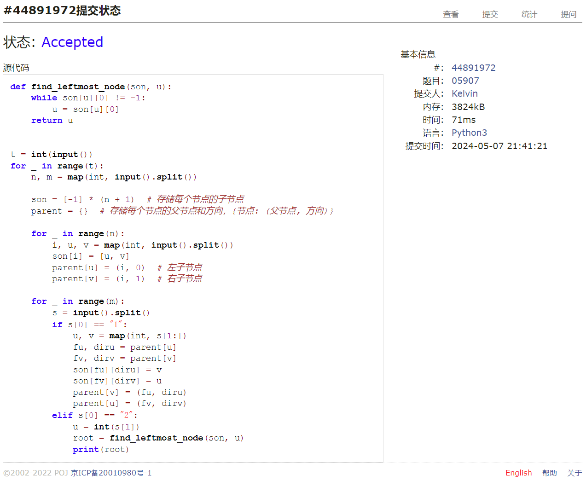

# Assignment #B: 图论和树算

Updated GMT+8 May 7, 2024

2024 spring, Complied by 钟俊宇 物理学院

**编程环境**

==Windows 11 家庭中文版, PyCharm Community Edition 2023.3.3==

## 1. 题目

### 28170: 算鹰

dfs, http://cs101.openjudge.cn/practice/28170/

思路：

标准的dfs

代码

```python
# 
def dfs(x, y):
    graph[x][y] = "-"
    for dx, dy in [(1, 0), (-1, 0), (0, 1), (0, -1)]:
        if 0 <= x+dx < 10 and 0 <= y+dy < 10 and graph[x+dx][y+dy] == ".":
            dfs(x+dx, y+dy)


graph = []
result = 0
for i in range(10):
    graph.append(list(input()))
for i in range(10):
    for j in range(10):
        if graph[i][j] == ".":
            result += 1
            dfs(i, j)
print(result)
```

代码运行截图 ==（至少包含有"Accepted"）==


### 02754: 八皇后

dfs, http://cs101.openjudge.cn/practice/02754/

思路：

dfs，判断两个皇后不在同一斜线的方法是两个皇后所在坐标的行差不等于列差。

代码

```python
# 
answer = []


def Queen(s):
    for col in range(1, 9):
        for j in range(len(s)):
            if str(col) == s[j] or abs(col - int(s[j])) == abs(len(s) - j):
                break
        else:
            if len(s) == 7:
                answer.append(s + str(col))
            else:
                Queen(s + str(col))


Queen('')
n = int(input())
for _ in range(n):
    a = int(input())
    print(answer[a - 1])
```

代码运行截图 ==（至少包含有"Accepted"）==


### 03151: Pots

bfs, http://cs101.openjudge.cn/practice/03151/

思路：

bfs

代码

```python
# 
def bfs(A, B, C):
    start = (0, 0)
    visited = set()
    visited.add(start)
    queue = [(start, [])]

    while queue:
        (a, b), actions = queue.pop(0)

        if a == C or b == C:
            return actions

        next_states = [(A, b), (a, B), (0, b), (a, 0),
                       (min(a + b, A), max(0, a + b - A)), (max(0, a + b - B), min(a + b, B))]

        for i in next_states:
            if i not in visited:
                visited.add(i)
                new_actions = actions + [get_action(a, b, i)]
                queue.append((i, new_actions))

    return ["impossible"]


def get_action(a, b, next_state):
    if next_state == (A, b):
        return "FILL(1)"
    elif next_state == (a, B):
        return "FILL(2)"
    elif next_state == (0, b):
        return "DROP(1)"
    elif next_state == (a, 0):
        return "DROP(2)"
    elif next_state == (min(a + b, A), max(0, a + b - A)):
        return "POUR(2,1)"
    else:
        return "POUR(1,2)"


A, B, C = map(int, input().split())
solution = bfs(A, B, C)

if solution == ["impossible"]:
    print(solution[0])
else:
    print(len(solution))
    for i in solution:
        print(i)
```

代码运行截图 ==（AC代码截图，至少包含有"Accepted"）==


### 05907: 二叉树的操作

http://cs101.openjudge.cn/practice/05907/

思路：

建树的同时存储节点的子节点、父节点及父节点的方向。

代码

```python
# 
def find_leftmost_node(son, u):
    while son[u][0] != -1:
        u = son[u][0]
    return u


t = int(input())
for _ in range(t):
    n, m = map(int, input().split())

    son = [-1] * (n + 1)  # 存储每个节点的子节点
    parent = {}  # 存储每个节点的父节点和方向，{节点: (父节点, 方向)}

    for _ in range(n):
        i, u, v = map(int, input().split())
        son[i] = [u, v]
        parent[u] = (i, 0)  # 左子节点
        parent[v] = (i, 1)  # 右子节点

    for _ in range(m):
        s = input().split()
        if s[0] == "1":
            u, v = map(int, s[1:])
            fu, diru = parent[u]
            fv, dirv = parent[v]
            son[fu][diru] = v
            son[fv][dirv] = u
            parent[v] = (fu, diru)
            parent[u] = (fv, dirv)
        elif s[0] == "2":
            u = int(s[1])
            root = find_leftmost_node(son, u)
            print(root)
```

代码运行截图 ==（AC代码截图，至少包含有"Accepted"）==



### 18250: 冰阔落 I

Disjoint set, http://cs101.openjudge.cn/practice/18250/

思路：


代码

```python
# 

```


代码运行截图 ==（AC代码截图，至少包含有"Accepted"）==


### 05443: 兔子与樱花

http://cs101.openjudge.cn/practice/05443/


思路：


代码

```python
# 

```


代码运行截图 ==（AC代码截图，至少包含有"Accepted"）==


## 2. 学习总结和收获

最近在忙毕业论文，时间很有限，只能等论文写完之后来补了T_T


