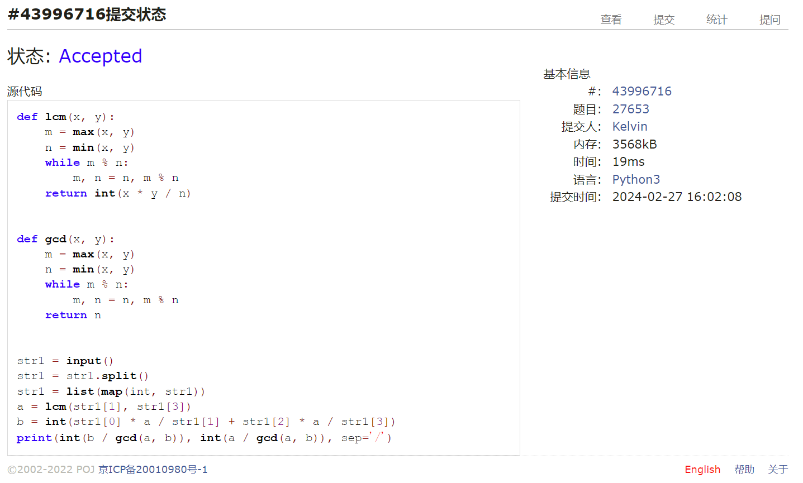
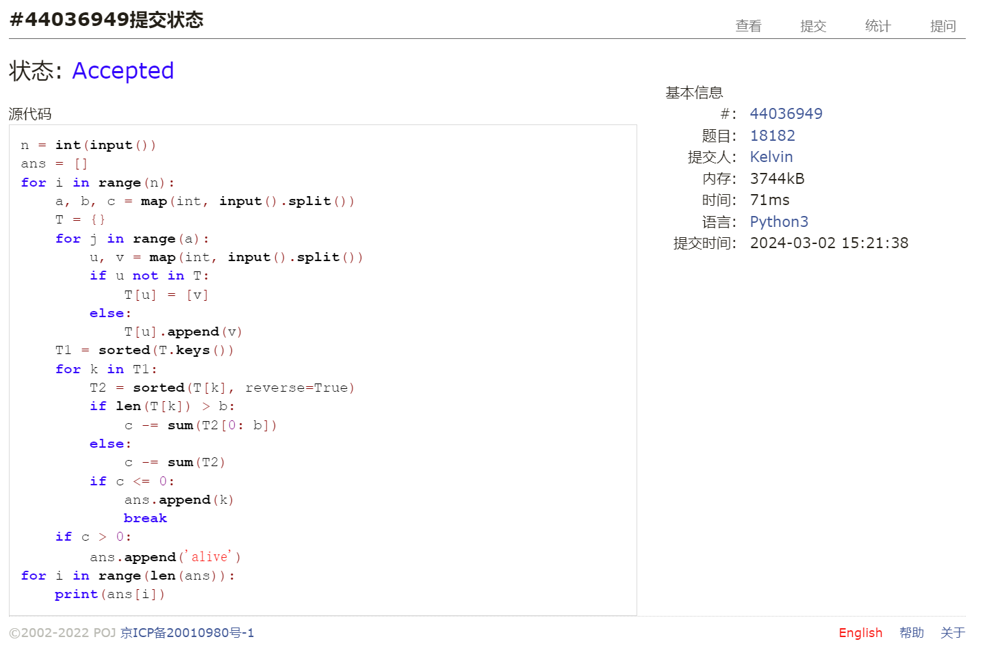

# Assignment #2: 编程练习

Updated GMT+8 March 10, 2024

2024 spring, Complied by 钟俊宇 物理学院

**编程环境**

==Windows 11 家庭中文版, PyCharm Community Edition 2023.3.3==

## 1. 题目

### 27653: Fraction类

http://cs101.openjudge.cn/practice/27653/

思路：

利用最大公因数和最小公倍数进行分数的加减

##### 代码

```python
# 
def lcm(x, y):
    m = max(x, y)
    n = min(x, y)
    while m % n:
        m, n = n, m % n
    return int(x * y / n)


def gcd(x, y):
    m = max(x, y)
    n = min(x, y)
    while m % n:
        m, n = n, m % n
    return n


str1 = list(map(int, input().split()))
a = lcm(str1[1], str1[3])
b = int(str1[0] * a / str1[1] + str1[2] * a / str1[3])
print(int(b / gcd(a, b)), int(a / gcd(a, b)), sep='/')
```

代码运行截图



### 04110: 圣诞老人的礼物-Santa Clau’s Gifts

greedy/dp, http://cs101.openjudge.cn/practice/04110

思路：

将礼物的平均价值按照降序排列，再依次填入，直到重量达到重量上限

##### 代码

```python
# 
str1 = list(map(int, input().split()))
str2 = []
weight = 0
value = 0
for i in range(str1[0]):
    a, b = map(int, input().split())
    str2.append([a, b, a/b])
str2 = sorted(str2, key=(lambda x: x[2]), reverse=True)
for i in range(str1[0]):
    if str1[1] - weight >= str2[i][1]:
        value += str2[i][0]
        weight += str2[i][1]
    else:
        value += (str1[1] - weight) * str2[i][2]
        break
print('%.1f' % value)
```

代码运行截图


### 18182: 打怪兽

implementation/sortings/data structures, http://cs101.openjudge.cn/practice/18182/

思路：

将技能按照出招时刻进行排序，然后对每个时刻按照技能伤害从高到低进行排序，计算每个时刻造成的最大伤害，然后与怪物血量进行对比，计算怪物血量减少为0的时刻

##### 代码

```python
# 
n = int(input())
ans = []
for i in range(n):
    a, b, c = map(int, input().split())
    T = {}
    for j in range(a):
        u, v = map(int, input().split())
        if u not in T:
            T[u] = [v]
        else:
            T[u].append(v)
    T1 = sorted(T.keys())
    for k in T1:
        T2 = sorted(T[k], reverse=True)
        if len(T[k]) > b:
            c -= sum(T2[0: b])
        else:
            c -= sum(T2)
        if c <= 0:
            ans.append(k)
            break
    if c > 0:
        ans.append('alive')
for i in range(len(ans)):
    print(ans[i])
```

代码运行截图



### 230B. T-primes

binary search/implementation/math/number theory, 1300, http://codeforces.com/problemset/problem/230/B

思路：

利用欧拉筛法筛出质数，再根据输入，找出其中平方根等于质数的数，即为T-prime

##### 代码

```python
# 
def euler(m, prime):
    p = 2
    while p * p <= m:
        if prime[p]:
            for i in range(p * p, m + 1, p):
                prime[i] = False
        p += 1


n = int(input())
x = [int(i) for i in input().split()]
s = [True] * (10 ** 6 + 1)
euler(10 ** 6, s)
for i in x:
    if i < 4:
        print('NO')
        continue
    elif int(i ** 0.5) ** 2 != i:
        print('NO')
        continue
    if s[int(i ** 0.5)]:
        print('YES')
    else:
        print('NO')

```

代码运行截图


### 1364A. XXXXX

brute force/data structures/number theory/two pointers, 1200, https://codeforces.com/problemset/problem/1364/A

思路：

取余数，大幅减少计算量;若余数之和不能被b整除，则输出数组长度;若余数之和能被b整除，则观察数组头尾取值，若头尾均为0，说明去掉头或尾的数后，数组仍能被b整除，此时观察次头项与次尾项，以此类推，当有一头的数不为0时，说明去掉该数后数组不能被b整除，输出此时数组长度

##### 代码

```python
# 
for _ in range(int(input())):
    a, b = map(int, input().split())
    s = -1
    A = list(map(lambda x: int(x) % b, input().split()))      # 取余数，大幅减少计算量
    if sum(A) % b:                                            # 若余数之和不能被b整除，则输出数组长度
        print(a)
        continue
    for i in range(a//2+1):
        if A[i] or A[~i]:  # 若余数之和能被b整除，则观察数组头尾取值，若头尾均为0，说明去掉头或尾的数后，
            s = a-i-1      # 数组仍能被b整除，此时观察次头项与次尾项，以此类推，当有一头的数不为0时，
            break          # 说明去掉该数后数组不能被b整除，输出此时数组长度
    print(s)
```

代码运行截图


### 18176: 2050年成绩计算

http://cs101.openjudge.cn/practice/18176/

思路：

与第四题T-prime相同，使用欧拉筛法

##### 代码

```python
# 
from math import sqrt
N = 10005

s = [True] * N
p = 2
while p * p <= N:
    if s[p]:
        for i in range(p * 2, N, p):
            s[i] = False
    p += 1

m, n = [int(i) for i in input().split()]

for i in range(m):
    x = [int(i) for i in input().split()]
    sum = 0
    for num in x:
        root = int(sqrt(num))
        if num > 3 and s[root] and num == root * root:
            sum += num
    sum /= len(x)
    if sum == 0:
        print(0)
    else:
        print('%.2f' % sum)
```

代码运行截图


## 2. 学习总结和收获

最后三道题老是超时，对欧拉筛法以及如何高效地判断整除有了深刻的印象


