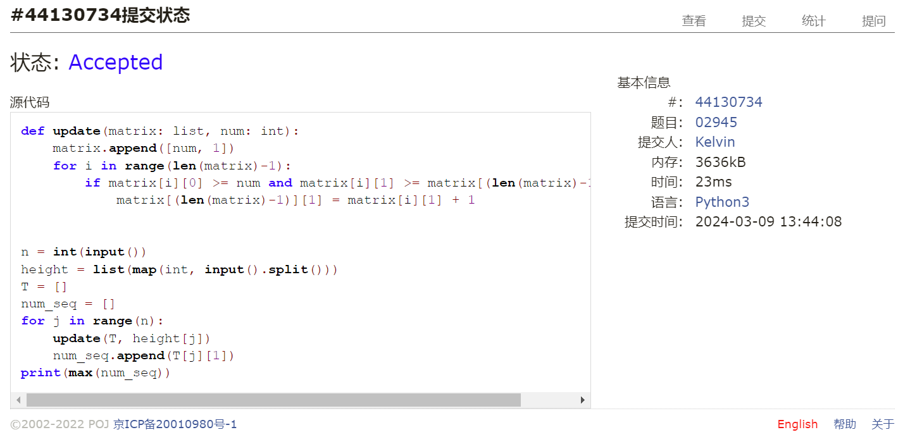
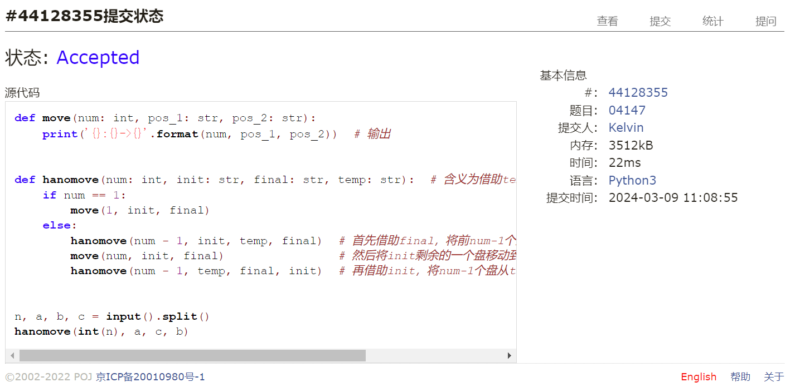
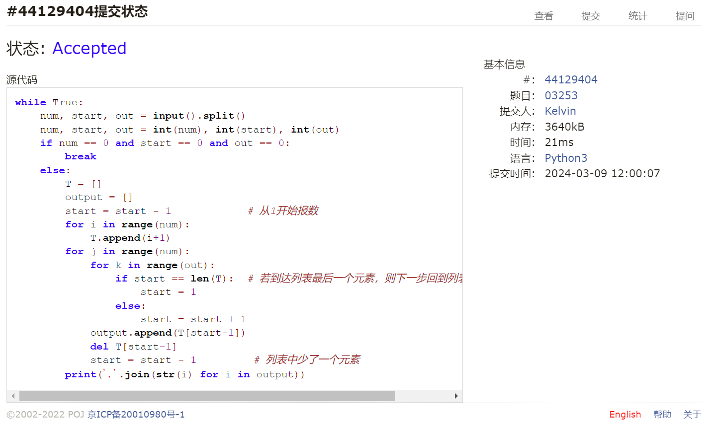
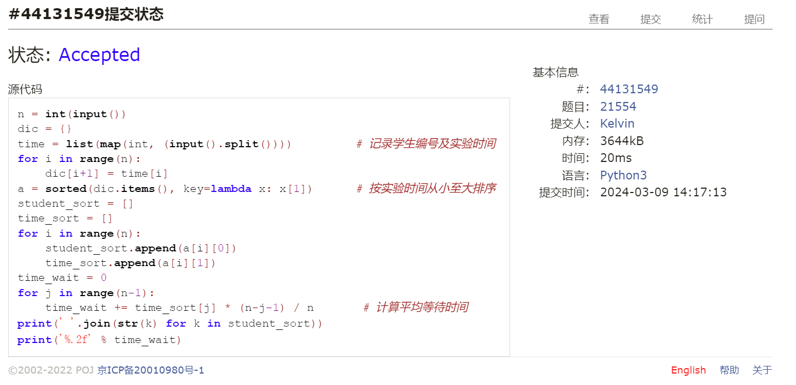
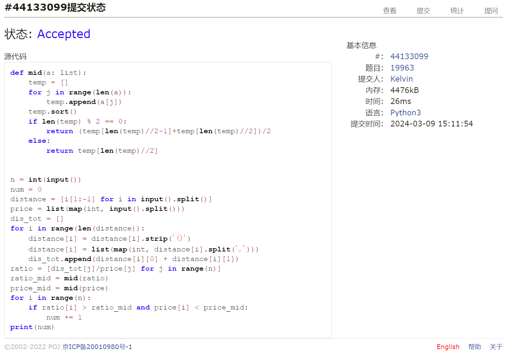
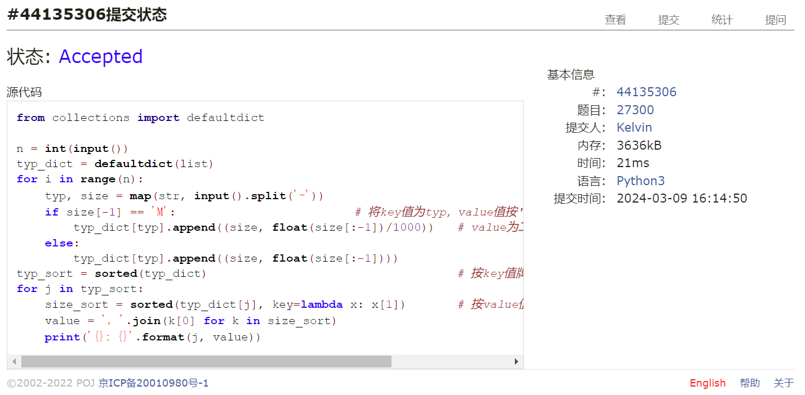

# Assignment #3: March月考

Updated GMT+8 March 9, 2024

2024 spring, Complied by 钟俊宇 物理学院

**编程环境**

==Windows 11 家庭中文版, PyCharm Community Edition 2023.3.3==

## 1. 题目

**02945: 拦截导弹**

http://cs101.openjudge.cn/practice/02945/

思路：

通过递推的方法，不断在已有数列尾端添加新数，记录以该数结尾的最大下降序列元素个数，最后寻找最大下降序列的最大值

##### 代码

```python
# def update(matrix: list, num: int):  # 在数列尾端新加一个数，记录以该数结尾的最大下降序列元素个数
    matrix.append([num, 1])
    for i in range(len(matrix)-1):
        if matrix[i][0] >= num and matrix[i][1] >= matrix[(len(matrix)-1)][1]:
            matrix[(len(matrix)-1)][1] = matrix[i][1] + 1


n = int(input())
height = list(map(int, input().split()))
T = []
num_seq = []                         # 递推
for j in range(n):
    update(T, height[j])
    num_seq.append(T[j][1])
print(max(num_seq))
```

代码运行截图



**04147:汉诺塔问题(Tower of Hanoi)**

http://cs101.openjudge.cn/practice/04147

思路：

通过递归的方法，将整体的移动拆分为单个盘的移动

##### 代码

```python
# def move(num: int, pos_1: str, pos_2: str):
    print('{}:{}->{}'.format(num, pos_1, pos_2))  # 输出


def hanomove(num: int, init: str, final: str, temp: str):  # 含义为借助temp，将num个盘从init移动到final
    if num == 1:
        move(1, init, final)
    else:
        hanomove(num - 1, init, temp, final)  # 首先借助final，将前num-1个盘从init移动到temp
        move(num, init, final)                # 然后将init剩余的一个盘移动到final
        hanomove(num - 1, temp, final, init)  # 再借助init，将num-1个盘从temp移动到final


n, a, b, c = input().split()
hanomove(int(n), a, c, b)
```

代码运行截图



**03253: 约瑟夫问题No.2**

http://cs101.openjudge.cn/practice/03253

思路：

报数相当于遍历列表中的值，在遍历到达列表末端后再回到列表头部

##### 代码

```python
# while True:
    num, start, out = input().split()
    num, start, out = int(num), int(start), int(out)
    if num == 0 and start == 0 and out == 0:
        break
    else:
        T = []
        output = []
        start = start - 1            # 从1开始报数
        for i in range(num):
            T.append(i+1)
        for j in range(num):
            for k in range(out):
                if start == len(T):  # 若到达列表最后一个元素，则下一步回到列表第一个元素
                    start = 1
                else:
                    start = start + 1
            output.append(T[start-1])
            del T[start-1]
            start = start - 1         # 列表中少了一个元素
        print(','.join(str(i) for i in output))
```

代码运行截图



**21554:排队做实验 (greedy)v0.2**

http://cs101.openjudge.cn/practice/21554

思路：

按实验时间长短升序排列，相同实验时间按编号升序排序

##### 代码

```python
# n = int(input())
dic = {}
time = list(map(int, (input().split())))         # 记录学生编号及实验时间
for i in range(n):
    dic[i+1] = time[i]
a = sorted(dic.items(), key=lambda x: x[1])      # 按实验时间从小至大排序
student_sort = []
time_sort = []
for i in range(n):
    student_sort.append(a[i][0])
    time_sort.append(a[i][1])
time_wait = 0
for j in range(n-1):
    time_wait += time_sort[j] * (n-j-1) / n       # 计算平均等待时间
print(' '.join(str(k) for k in student_sort))
print('%.2f' % time_wait)
```

代码运行截图



**19963:买学区房**

http://cs101.openjudge.cn/practice/19963

思路：

计算中位数，判断大小

##### 代码

```python
# def mid(a: list):                # 计算中位数
    temp = []
    for j in range(len(a)):
        temp.append(a[j])
    temp.sort()
    if len(temp) % 2 == 0:
        return (temp[len(temp)//2-1]+temp[len(temp)//2])/2
    else:
        return temp[len(temp)//2]


n = int(input())
num = 0
distance = [i[1:-1] for i in input().split()]
price = list(map(int, input().split()))
dis_tot = []
for i in range(len(distance)):                    # 计算距离
    distance[i] = distance[i].strip('()')
    distance[i] = list(map(int, distance[i].split(',')))
    dis_tot.append(int(distance[i][0] + distance[i][1]))
ratio = [dis_tot[j]/price[j] for j in range(n)]   # 计算性价比
ratio_mid = mid(ratio)
price_mid = mid(price)
for i in range(n):
    if ratio[i] > ratio_mid and price[i] < price_mid:
        num += 1
print(num)
```

代码运行截图



**27300: 模型整理**

http://cs101.openjudge.cn/practice/27300

思路：

处理字符串，使用字典方法进行整合，先对key值排序，然后对value值排序，最后输出

##### 代码

```python
# from collections import defaultdict

n = int(input())
typ_dict = defaultdict(list)
for i in range(n):
    typ, size = map(str, input().split('-'))
    if size[-1] == 'M':                         # 将key值为typ，value值按'M'、'B'分类的元素导入字典
        typ_dict[typ].append((size, float(size[:-1])/1000))   # value为二位列表，便于后续排序
    else:
        typ_dict[typ].append((size, float(size[:-1])))
typ_sort = sorted(typ_dict)                                   # 按key值牌序
for j in typ_sort:
    size_sort = sorted(typ_dict[j], key=lambda x: x[1])       # 按value值排序
    value = ', '.join(k[0] for k in size_sort)
    print('{}: {}'.format(j, value))
```

代码运行截图



## 2. 学习总结和收获

对字符串的处理，对字典的使用还不太熟练，当前做题速度偏慢，大四人只求及格


