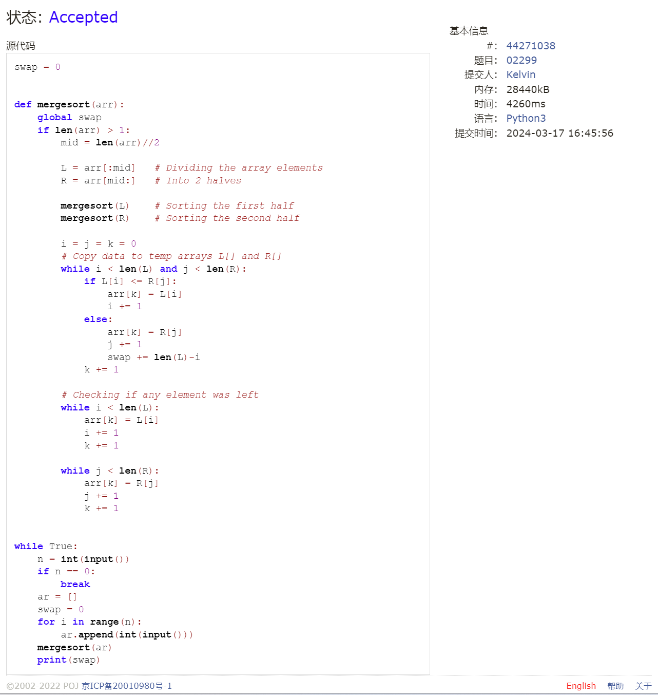

# Assignment #4: 排序、栈、队列和树

Updated GMT+8 March 17, 2024

2024 spring, Complied by 钟俊宇 物理学院

**编程环境**

==Windows 11 家庭中文版, PyCharm Community Edition 2023.3.3==

## 1. 题目

### 05902: 双端队列

http://cs101.openjudge.cn/practice/05902/

思路：

使用append和pop操作实现

代码

```python
# 
for _ in range(int(input())):
    n = int(input())
    arr = []
    for _ in range(n):
        ope, num = map(int, input().split())
        if ope == 1:
            arr.append(num)
        elif ope == 2:
            if num == 1:
                arr.pop()
            elif num == 0:
                arr.pop(0)
    if not arr:
        print('NULL')
    else:
        print(' '.join(str(i) for i in arr))
```

代码运行截图


### 02694: 波兰表达式

http://cs101.openjudge.cn/practice/02694/

思路：

递归 + 栈

代码

```python
# 
s = input().split()


def cal():
    cur = s.pop(0)
    if cur in '+-*/':
        return str(eval(cal() + cur + cal()))
    else:
        return cur


print('%.6f' % float(cal()))
```

代码运行截图


### 24591: 中序表达式转后序表达式

http://cs101.openjudge.cn/practice/24591/

思路：

构造算符栈和输出栈，分情况讨论，有亿点复杂

代码

```python
# 
def infix_to_postfix(expression):
    precedence = {'+': 1, '-': 1, '*': 2, '/': 2}
    stack = []
    postfix = []
    number = ''

    for char in expression:
        if char.isnumeric() or char == '.':
            number += char
        else:
            if number:
                num = float(number)
                postfix.append(int(num) if num.is_integer() else num)
                number = ''
            if char in '+-*/':
                while stack and stack[-1] in '+-*/' and precedence[char] <= precedence[stack[-1]]:
                    postfix.append(stack.pop())
                stack.append(char)
            elif char == '(':
                stack.append(char)
            elif char == ')':
                while stack and stack[-1] != '(':
                    postfix.append(stack.pop())
                stack.pop()

    if number:
        num = float(number)
        postfix.append(int(num) if num.is_integer() else num)

    while stack:
        postfix.append(stack.pop())

    return ' '.join(str(x) for x in postfix)


n = int(input())
for _ in range(n):
    expression = input()
    print(infix_to_postfix(expression))
```

代码运行截图


### 22068: 合法出栈序列

http://cs101.openjudge.cn/practice/22068/

思路：

将入栈序列与出栈序列逐一比较，分情况讨论

代码

```python
# 
str0 = input()
while 1:
    try:
        str1 = input()
        str_temp = []
        if len(str0) != len(str1):
            print('NO')
        else:
            i = 0
            j = 0
            while 1:
                if not str_temp:
                    if i == len(str0):
                        break
                    str_temp.append(str0[i])
                    i += 1
                if str_temp[-1] != str1[j]:
                    if i == len(str0):
                        break
                    str_temp.append(str0[i])
                    i += 1
                else:
                    j += 1
                    str_temp.pop()
                if j == len(str1):
                    break
            if j == len(str1):
                print('YES')
            else:
                print('NO')
    except EOFError:
        break
```

代码运行截图


### 06646: 二叉树的深度

http://cs101.openjudge.cn/practice/06646/

思路：

构造类，用递归的方法求深度

代码

```python
# 
class Treenode:
    def __init__(self):
        self.left = None
        self.right = None


def tree_depth(node):
    if node is None:
        return 0
    left_depth = tree_depth(node.left)
    right_depth = tree_depth(node.right)
    return max(left_depth, right_depth)+1


n = int(input())
nodes = [Treenode() for _ in range(n)]
for i in range(n):
    left, right = map(int, input().split())
    if left != -1:
        nodes[i].left = nodes[left-1]
    if right != -1:
        nodes[i].right = nodes[right-1]
root = nodes[0]
depth = tree_depth(root)
print(depth)
```

代码运行截图


### 02299: Ultra-QuickSort

http://cs101.openjudge.cn/practice/02299/

思路：

使用归并排序（递归+分治），统计交换数

代码

```python
# 
swap = 0


def mergesort(arr):
    global swap
    if len(arr) > 1:
        mid = len(arr)//2

        L = arr[:mid]   # Dividing the array elements
        R = arr[mid:]   # Into 2 halves

        mergesort(L)    # Sorting the first half
        mergesort(R)    # Sorting the second half

        i = j = k = 0
        # Copy data to temp arrays L[] and R[]
        while i < len(L) and j < len(R):
            if L[i] <= R[j]:
                arr[k] = L[i]
                i += 1
            else:
                arr[k] = R[j]
                j += 1
                swap += len(L)-i
            k += 1

        # Checking if any element was left
        while i < len(L):
            arr[k] = L[i]
            i += 1
            k += 1

        while j < len(R):
            arr[k] = R[j]
            j += 1
            k += 1


while True:
    n = int(input())
    if n == 0:
        break
    ar = []
    swap = 0
    for i in range(n):
        ar.append(int(input()))
    mergesort(ar)
    print(swap)
```

代码运行截图



## 2. 学习总结和收获

对递归有了更深入的理解，但写起来还比较生疏，有待多加练习。中序表达式转后序表达式写起来尤其困难，考试的时候打算把这题的代码打印下来带进去。
