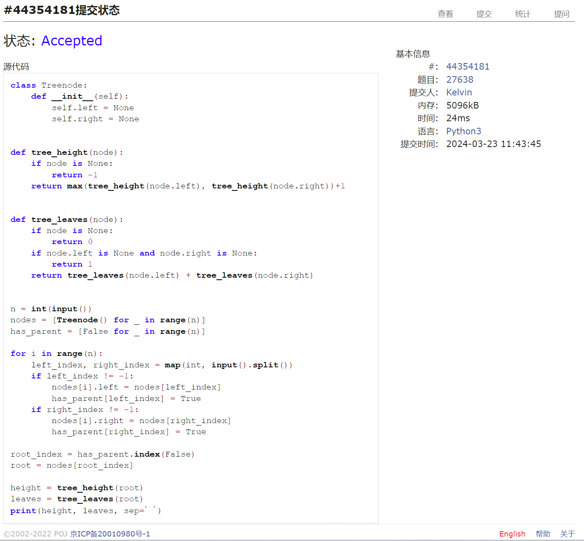
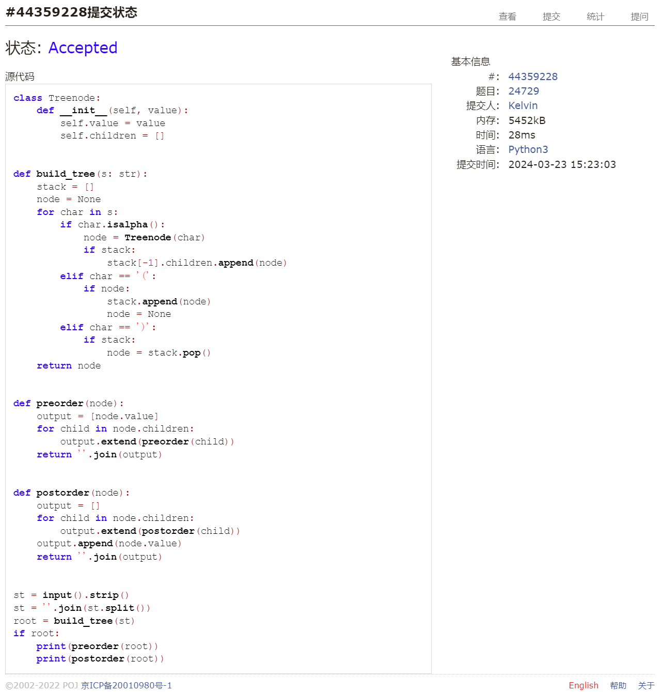
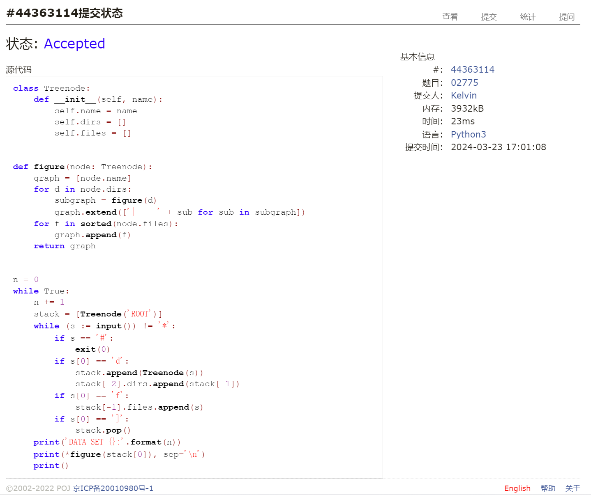
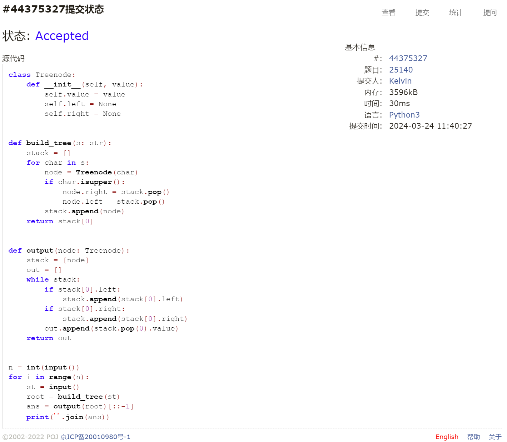
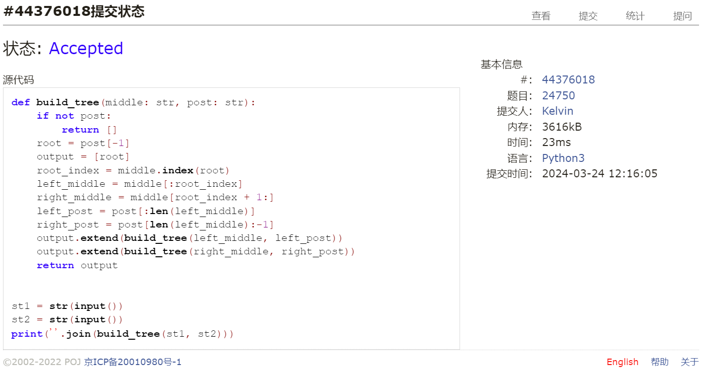
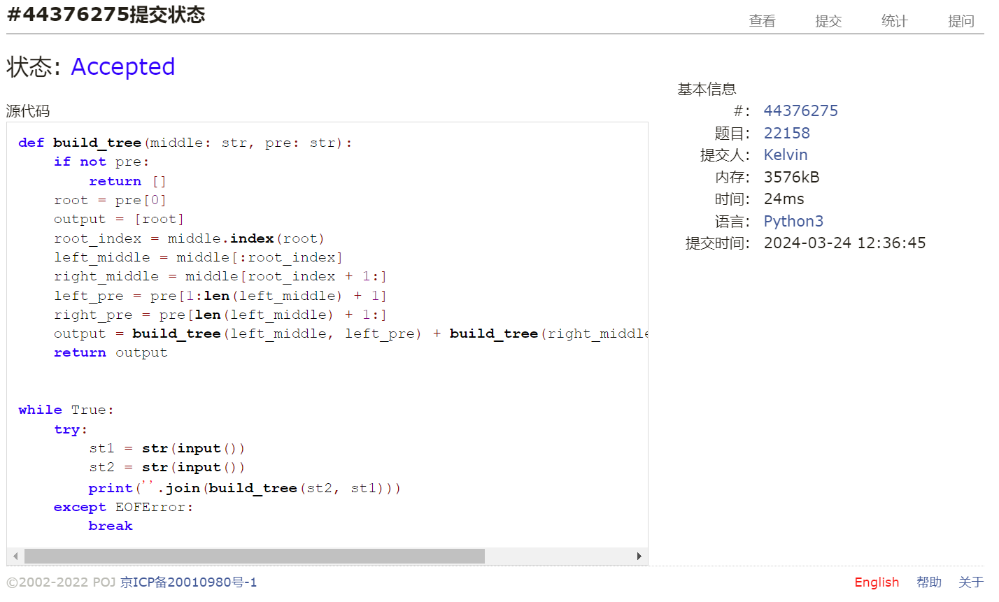

# Assignment #5: "树"算：概念、表示、解析、遍历

Updated GMT+8 March 24, 2024

2024 spring, Complied by 钟俊宇 物理学院

**编程环境**

==Windows 11 家庭中文版, PyCharm Community Edition 2023.3.3==

## 1. 题目

### 27638: 求二叉树的高度和叶子数目

http://cs101.openjudge.cn/practice/27638/

思路：

寻找根节点，然后递归

代码

```python
# 
class Treenode:
    def __init__(self):
        self.left = None
        self.right = None


def tree_height(node):
    if node is None:
        return -1
    return max(tree_height(node.left), tree_height(node.right))+1


def tree_leaves(node):
    if node is None:
        return 0
    if node.left is None and node.right is None:
        return 1
    return tree_leaves(node.left) + tree_leaves(node.right)


n = int(input())
nodes = [Treenode() for _ in range(n)]
has_parent = [False for _ in range(n)]

for i in range(n):                     # 读取信息
    left_index, right_index = map(int, input().split())
    if left_index != -1:
        nodes[i].left = nodes[left_index]
        has_parent[left_index] = True
    if right_index != -1:
        nodes[i].right = nodes[right_index]
        has_parent[right_index] = True

root_index = has_parent.index(False)   # 寻找根节点
root = nodes[root_index]

height = tree_height(root)
leaves = tree_leaves(root)
print(height, leaves, sep=' ')
```

代码运行截图



### 24729: 括号嵌套树

http://cs101.openjudge.cn/practice/24729/

思路：

通过栈将输入转化成树，然后按不同次序输出

代码

```python
# 
class Treenode:
    def __init__(self, value):
        self.value = value
        self.children = []


def build_tree(s: str):
    stack = []
    node = None
    for char in s:
        if char.isalpha():
            node = Treenode(char)
            if stack:
                stack[-1].children.append(node)
        elif char == '(':
            if node:
                stack.append(node)
                node = None
        elif char == ')':
            if stack:
                node = stack.pop()
    return node


def preorder(node):
    output = [node.value]
    for child in node.children:
        output.extend(preorder(child))
    return ''.join(output)


def postorder(node):
    output = []
    for child in node.children:
        output.extend(postorder(child))
    output.append(node.value)
    return ''.join(output)


st = input().strip()
st = ''.join(st.split())
root = build_tree(st)
if root:
    print(preorder(root))
    print(postorder(root))
```

代码运行截图



### 02775: 文件结构“图”

http://cs101.openjudge.cn/practice/02775/

思路：

通过栈来构建树，通过递归的方式来输出文件结构图

代码

```python
# 
class Treenode:
    def __init__(self, name):
        self.name = name
        self.dirs = []
        self.files = []


def figure(node: Treenode):
    graph = [node.name]
    for d in node.dirs:
        subgraph = figure(d)
        graph.extend(['|     ' + sub for sub in subgraph])
    for f in sorted(node.files):
        graph.append(f)
    return graph


n = 0
while True:
    n += 1
    stack = [Treenode('ROOT')]
    while (s := input()) != '*':
        if s == '#':
            exit(0)
        if s[0] == 'd':
            stack.append(Treenode(s))
            stack[-2].dirs.append(stack[-1])
        if s[0] == 'f':
            stack[-1].files.append(s)
        if s[0] == ']':
            stack.pop()
    print('DATA SET {}:'.format(n))
    print(*figure(stack[0]), sep='\n')
    print()
```

代码运行截图



### 25140: 根据后序表达式建立队列表达式

http://cs101.openjudge.cn/practice/25140/

思路：

通过栈来构建树和输出

代码

```python
# 
class Treenode:
    def __init__(self, value):
        self.value = value
        self.left = None
        self.right = None


def build_tree(s: str):
    stack = []
    for char in s:
        node = Treenode(char)
        if char.isupper():
            node.right = stack.pop()
            node.left = stack.pop()
        stack.append(node)
    return stack[0]


def output(node: Treenode):
    stack = [node]
    out = []
    while stack:
        if stack[0].left:
            stack.append(stack[0].left)
        if stack[0].right:
            stack.append(stack[0].right)
        out.append(stack.pop(0).value)
    return out


n = int(input())
for i in range(n):
    st = input()
    root = build_tree(st)
    ans = output(root)[::-1]
    print(''.join(ans))
```

代码运行截图



### 24750: 根据二叉树中后序序列建树

http://cs101.openjudge.cn/practice/24750/

思路：

通过递归和分治的方法构建树

代码

```python
# 
def build_tree(middle: str, post: str):
    if not post:
        return []
    root = post[-1]
    output = [root]
    root_index = middle.index(root)
    left_middle = middle[:root_index]
    right_middle = middle[root_index + 1:]
    left_post = post[:len(left_middle)]
    right_post = post[len(left_middle):-1]
    output.extend(build_tree(left_middle, left_post))
    output.extend(build_tree(right_middle, right_post))
    return output


st1 = str(input())
st2 = str(input())
print(''.join(build_tree(st1, st2)))
```

代码运行截图



### 22158: 根据二叉树前中序序列建树

http://cs101.openjudge.cn/practice/22158/

思路：

通过递归和分治的方法构建树

代码

```python
# 
def build_tree(middle: str, pre: str):
    if not pre:
        return []
    root = pre[0]
    output = [root]
    root_index = middle.index(root)
    left_middle = middle[:root_index]
    right_middle = middle[root_index + 1:]
    left_pre = pre[1:len(left_middle) + 1]
    right_pre = pre[len(left_middle) + 1:]
    output = (build_tree(left_middle, left_pre) +
              build_tree(right_middle, right_pre) + output)
    return output


while True:
    try:
        st1 = str(input())
        st2 = str(input())
        print(''.join(build_tree(st2, st1)))
    except EOFError:
        break
```

代码运行截图



## 2. 学习总结和收获

本周题目对我而言较难，每道题都要花费一个小时左右的时间，对于递归的使用还不是很熟练，不过做完之后对树的结构有了更好的掌握，后续还要多回看多巩固。
