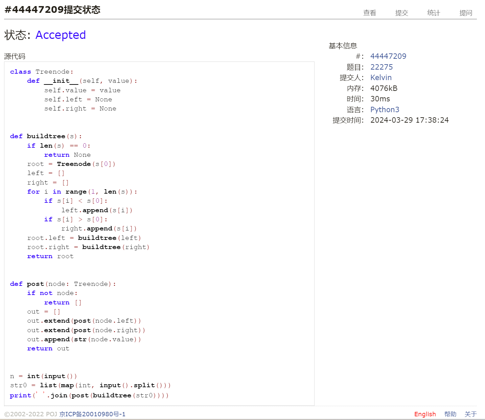
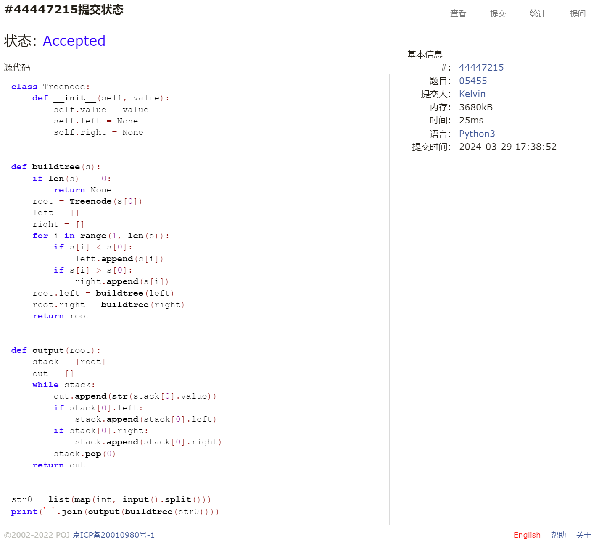
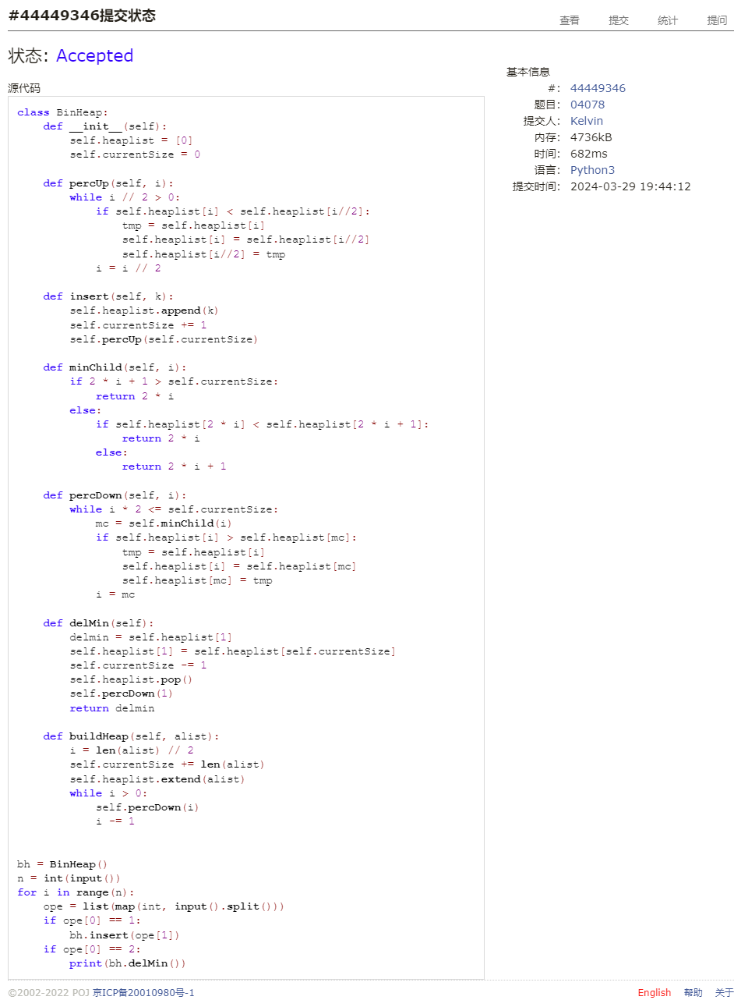
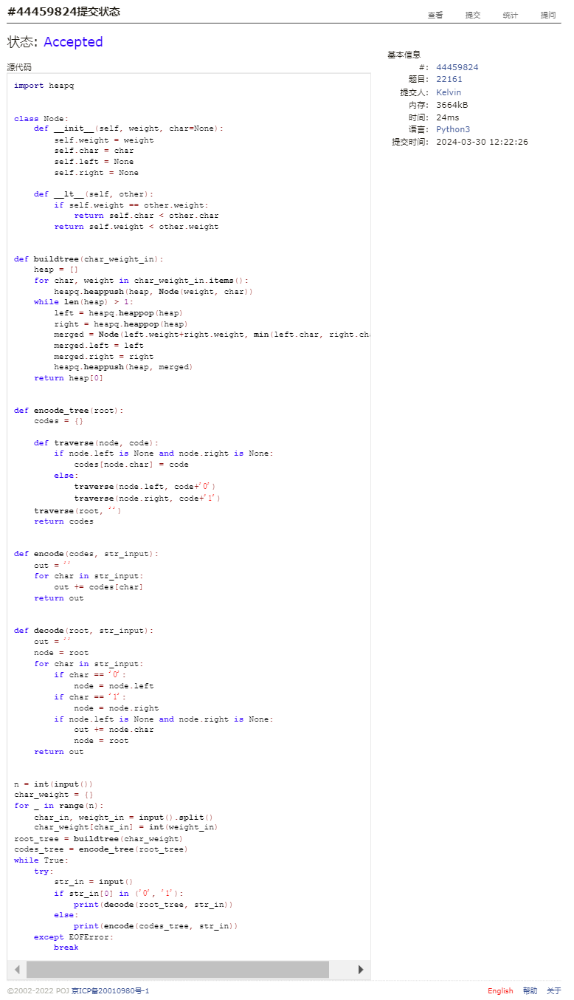
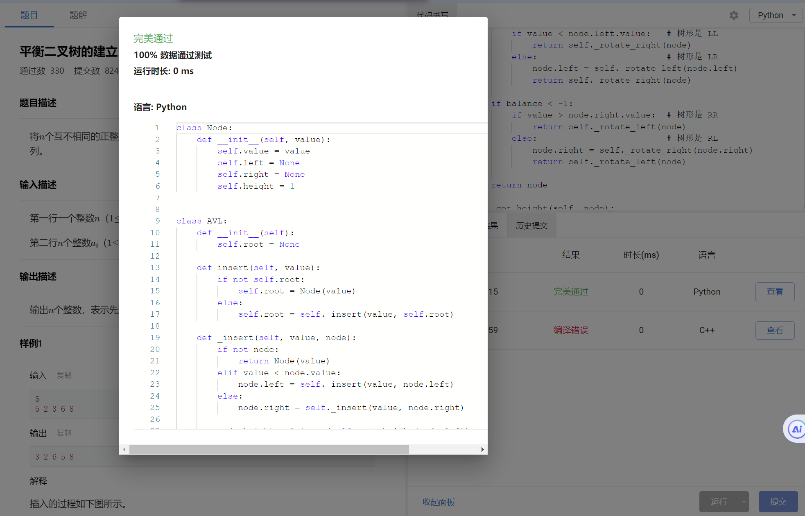
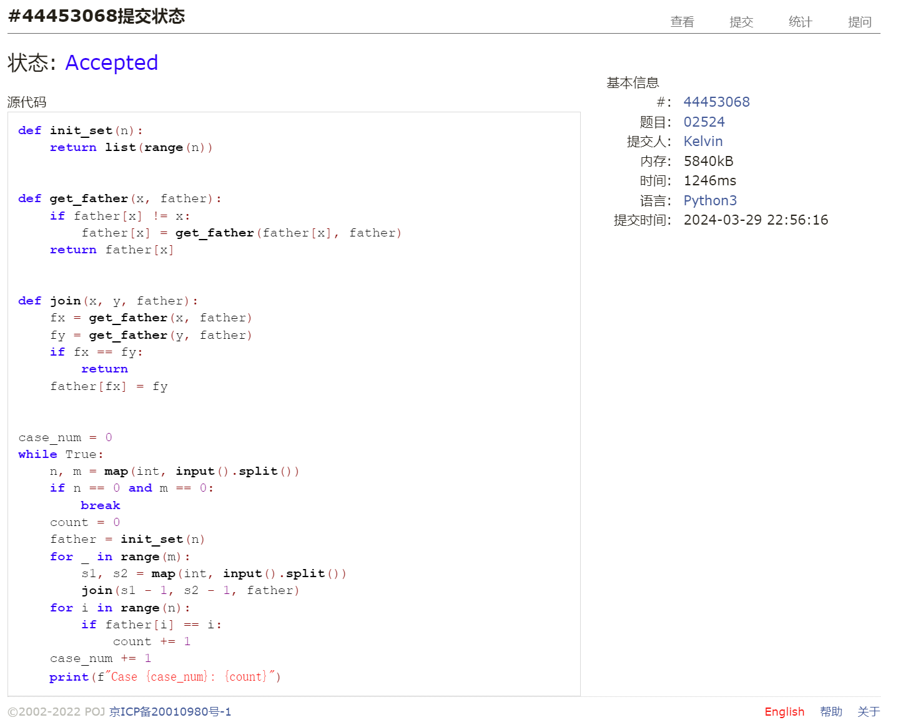

# Assignment #6: "树"算：Huffman,BinHeap,BST,AVL,DisjointSet

Updated GMT+8 March 30, 2024

2024 spring, Complied by 钟俊宇 物理学院

**编程环境**

==Windows 11 家庭中文版, PyCharm Community Edition 2023.3.3==

## 1. 题目

### 22275: 二叉搜索树的遍历

http://cs101.openjudge.cn/practice/22275/

思路：

根据二叉搜索树的性质建树，然后进行前序遍历

代码

```python
# 
class Treenode:
    def __init__(self, value):
        self.value = value
        self.left = None
        self.right = None


def buildtree(s):
    if len(s) == 0:
        return None
    root = Treenode(s[0])
    left = []
    right = []
    for i in range(1, len(s)):
        if s[i] < s[0]:
            left.append(s[i])
        if s[i] > s[0]:
            right.append(s[i])
    root.left = buildtree(left)
    root.right = buildtree(right)
    return root


def post(node: Treenode):
    if not node:
        return []
    out = []
    out.extend(post(node.left))
    out.extend(post(node.right))
    out.append(str(node.value))
    return out


n = int(input())
str0 = list(map(int, input().split()))
print(' '.join(post(buildtree(str0))))
```

代码运行截图



### 05455: 二叉搜索树的层次遍历

http://cs101.openjudge.cn/practice/05455/

思路：

同第一题类似，先根据二叉搜索树的性质建树，然后借助栈实现分层遍历

代码

```python
# 
class Treenode:
    def __init__(self, value):
        self.value = value
        self.left = None
        self.right = None


def buildtree(s):
    if len(s) == 0:
        return None
    root = Treenode(s[0])
    left = []
    right = []
    for i in range(1, len(s)):
        if s[i] < s[0]:
            left.append(s[i])
        if s[i] > s[0]:
            right.append(s[i])
    root.left = buildtree(left)
    root.right = buildtree(right)
    return root


def output(root):
    stack = [root]
    out = []
    while stack:
        out.append(str(stack[0].value))
        if stack[0].left:
            stack.append(stack[0].left)
        if stack[0].right:
            stack.append(stack[0].right)
        stack.pop(0)
    return out


str0 = list(map(int, input().split()))
print(' '.join(output(buildtree(str0))))
```

代码运行截图



### 04078: 实现堆结构

http://cs101.openjudge.cn/practice/04078/

练习自己写个BinHeap。当然机考时候，如果遇到这样题目，直接import heapq。手搓栈、队列、堆、AVL等，考试前需要搓个遍。

思路：

参照课件中的代码来写

代码

```python
# 
class BinHeap:
    def __init__(self):
        self.heaplist = [0]
        self.currentSize = 0

    def percUp(self, i):
        while i // 2 > 0:
            if self.heaplist[i] < self.heaplist[i//2]:
                tmp = self.heaplist[i]
                self.heaplist[i] = self.heaplist[i//2]
                self.heaplist[i//2] = tmp
            i = i // 2

    def insert(self, k):
        self.heaplist.append(k)
        self.currentSize += 1
        self.percUp(self.currentSize)

    def minChild(self, i):
        if 2 * i + 1 > self.currentSize:
            return 2 * i
        else:
            if self.heaplist[2 * i] < self.heaplist[2 * i + 1]:
                return 2 * i
            else:
                return 2 * i + 1

    def percDown(self, i):
        while i * 2 <= self.currentSize:
            mc = self.minChild(i)
            if self.heaplist[i] > self.heaplist[mc]:
                tmp = self.heaplist[i]
                self.heaplist[i] = self.heaplist[mc]
                self.heaplist[mc] = tmp
            i = mc

    def delMin(self):
        delmin = self.heaplist[1]
        self.heaplist[1] = self.heaplist[self.currentSize]
        self.currentSize -= 1
        self.heaplist.pop()
        self.percDown(1)
        return delmin

    def buildHeap(self, alist):
        i = len(alist) // 2
        self.currentSize += len(alist)
        self.heaplist.extend(alist)
        while i > 0:
            self.percDown(i)
            i -= 1


bh = BinHeap()
n = int(input())
for i in range(n):
    ope = list(map(int, input().split()))
    if ope[0] == 1:
        bh.insert(ope[1])
    if ope[0] == 2:
        print(bh.delMin())
```

代码运行截图



### 22161: 哈夫曼编码树

http://cs101.openjudge.cn/practice/22161/

思路：

利用上一题二叉堆的结构来建树，有些复杂，也是参考着课件给的代码来写的

代码

```python
# 
import heapq


class Node:
    def __init__(self, weight, char=None):
        self.weight = weight
        self.char = char
        self.left = None
        self.right = None

    def __lt__(self, other):
        if self.weight == other.weight:
            return self.char < other.char
        return self.weight < other.weight


def buildtree(char_weight_in):
    heap = []
    for char, weight in char_weight_in.items():
        heapq.heappush(heap, Node(weight, char))
    while len(heap) > 1:
        left = heapq.heappop(heap)
        right = heapq.heappop(heap)
        merged = Node(left.weight+right.weight, min(left.char, right.char))
        merged.left = left
        merged.right = right
        heapq.heappush(heap, merged)
    return heap[0]


def encode_tree(root):
    codes = {}

    def traverse(node, code):
        if node.left is None and node.right is None:
            codes[node.char] = code
        else:
            traverse(node.left, code+'0')
            traverse(node.right, code+'1')
    traverse(root, '')
    return codes


def encode(codes, str_input):
    out = ''
    for char in str_input:
        out += codes[char]
    return out


def decode(root, str_input):
    out = ''
    node = root
    for char in str_input:
        if char == '0':
            node = node.left
        if char == '1':
            node = node.right
        if node.left is None and node.right is None:
            out += node.char
            node = root
    return out


n = int(input())
char_weight = {}
for _ in range(n):
    char_in, weight_in = input().split()
    char_weight[char_in] = int(weight_in)
root_tree = buildtree(char_weight)
codes_tree = encode_tree(root_tree)
while True:
    try:
        str_in = input()
        if str_in[0] in ('0', '1'):
            print(decode(root_tree, str_in))
        else:
            print(encode(codes_tree, str_in))
    except EOFError:
        break
```

代码运行截图



### 晴问9.5: 平衡二叉树的建立

https://sunnywhy.com/sfbj/9/5/359

思路：

手动搭建AVL树结构，非常复杂，还是参考着课件来写的

代码

```python
# 
class Node:
    def __init__(self, value):
        self.value = value
        self.left = None
        self.right = None
        self.height = 1


class AVL:
    def __init__(self):
        self.root = None

    def insert(self, value):
        if not self.root:
            self.root = Node(value)
        else:
            self.root = self._insert(value, self.root)

    def _insert(self, value, node):
        if not node:
            return Node(value)
        elif value < node.value:
            node.left = self._insert(value, node.left)
        else:
            node.right = self._insert(value, node.right)

        node.height = 1 + max(self._get_height(node.left), self._get_height(node.right))

        balance = self._get_balance(node)

        if balance > 1:
            if value < node.left.value:   # 树形是 LL
                return self._rotate_right(node)
            else:                         # 树形是 LR
                node.left = self._rotate_left(node.left)
                return self._rotate_right(node)

        if balance < -1:
            if value > node.right.value:  # 树形是 RR
                return self._rotate_left(node)
            else:                         # 树形是 RL
                node.right = self._rotate_right(node.right)
                return self._rotate_left(node)

        return node

    def _get_height(self, node):
        if not node:
            return 0
        return node.height

    def _get_balance(self, node):
        if not node:
            return 0
        return self._get_height(node.left) - self._get_height(node.right)

    def _rotate_left(self, z):
        y = z.right
        T2 = y.left
        y.left = z
        z.right = T2
        z.height = 1 + max(self._get_height(z.left), self._get_height(z.right))
        y.height = 1 + max(self._get_height(y.left), self._get_height(y.right))
        return y

    def _rotate_right(self, y):
        x = y.left
        T2 = x.right
        x.right = y
        y.left = T2
        y.height = 1 + max(self._get_height(y.left), self._get_height(y.right))
        x.height = 1 + max(self._get_height(x.left), self._get_height(x.right))
        return x

    def preorder(self):
        return self._preorder(self.root)

    def _preorder(self, node):
        if not node:
            return []
        return [node.value] + self._preorder(node.left) + self._preorder(node.right)


n = int(input().strip())
sequence = list(map(int, input().strip().split()))
avl = AVL()
for value in sequence:
    avl.insert(value)
print(' '.join(map(str, avl.preorder())))
```

代码运行截图



### 02524: 宗教信仰

http://cs101.openjudge.cn/practice/02524/

思路：

利用并查集中father函数的思想对宗教信仰进行分类

代码

```python
# 
def init_set(n):
    return list(range(n))


def get_father(x, father):
    if father[x] != x:
        father[x] = get_father(father[x], father)
    return father[x]


def join(x, y, father):
    fx = get_father(x, father)
    fy = get_father(y, father)
    if fx == fy:
        return
    father[fx] = fy


case_num = 0
while True:
    n, m = map(int, input().split())
    if n == 0 and m == 0:
        break
    count = 0
    father = init_set(n)
    for _ in range(m):
        s1, s2 = map(int, input().split())
        join(s1 - 1, s2 - 1, father)
    for i in range(n):
        if father[i] == i:
            count += 1
    case_num += 1
    print(f"Case {case_num}: {count}")
```

代码运行截图



## 2. 学习总结和收获

本次作业前两题还好，后面四道题对我而言比较困难，分别考察了二叉堆、哈夫曼编码算法、AVL树和并查集，做的时候参考着课件给的代码一行一行理解再手动敲一遍，深刻感受到了算法的精妙。考试的时候得把这部分的代码打印下来带进去。


