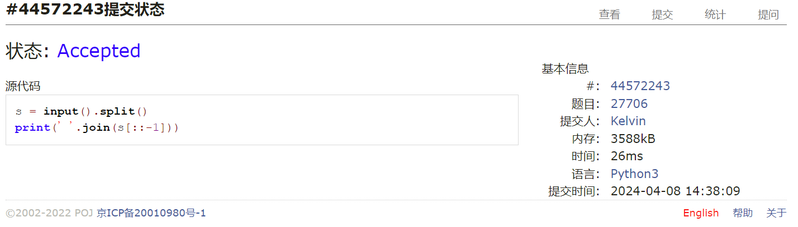
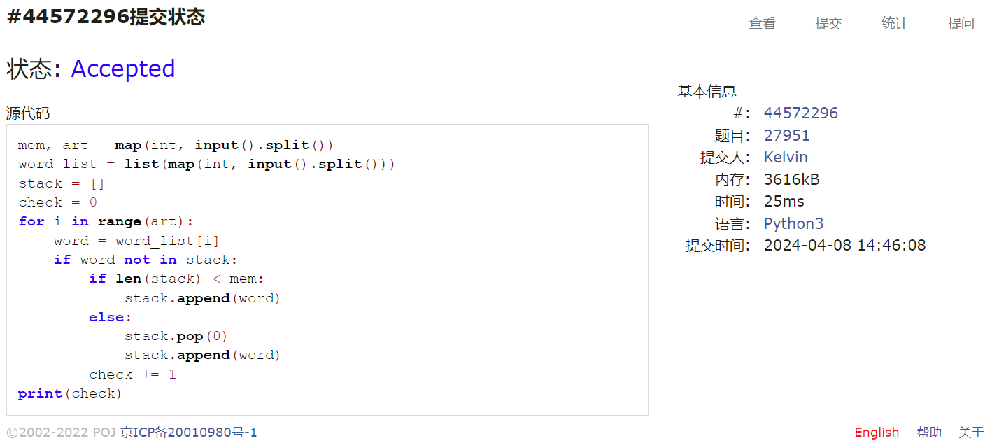
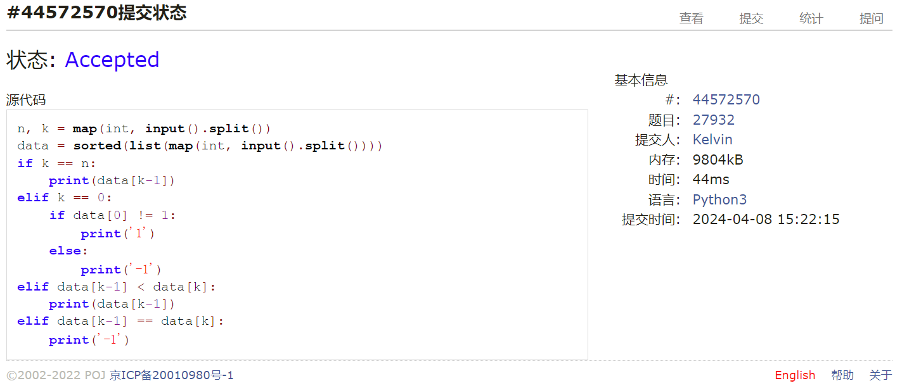
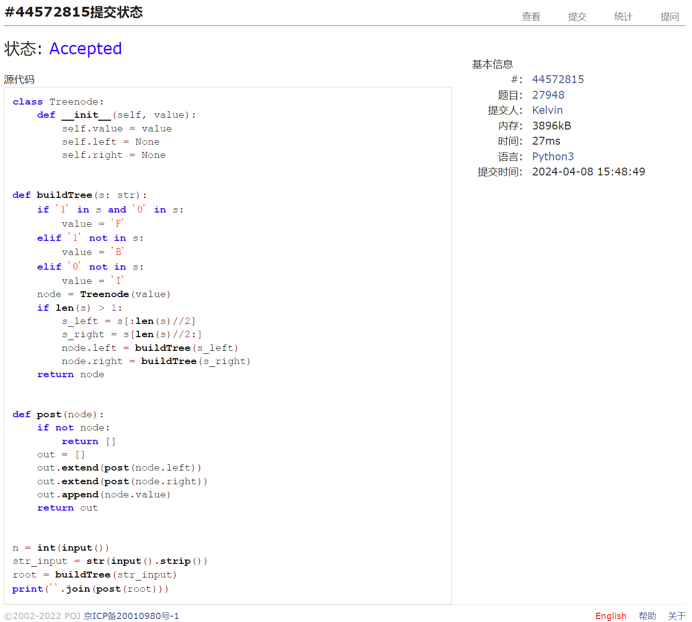
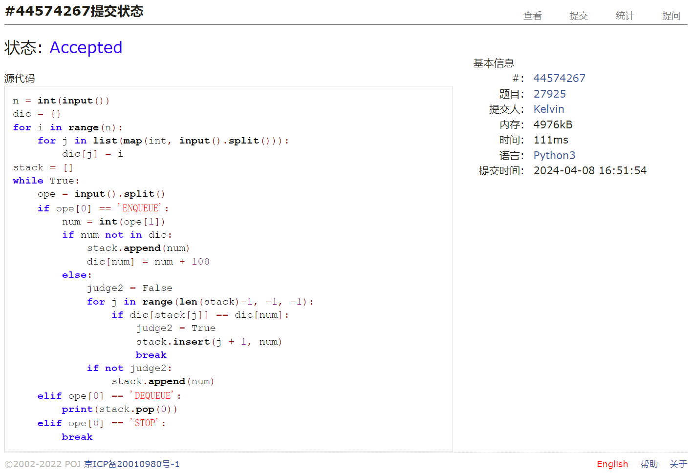
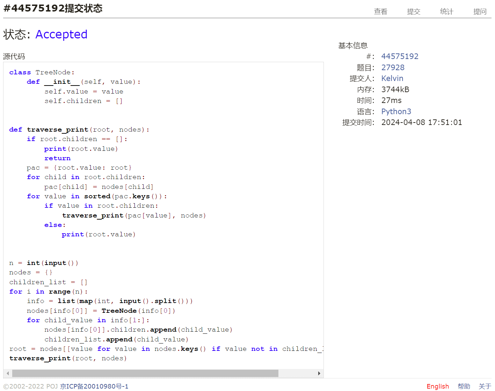

# Assignment #7: April 月考

Updated GMT+8 April 8, 2024

2024 spring, Complied by 钟俊宇 物理学院

**编程环境**

==Windows 11 家庭中文版, PyCharm Community Edition 2023.3.3==

## 1. 题目

### 27706: 逐词倒放

http://cs101.openjudge.cn/practice/27706/

思路：

逐词倒放

代码

```python
# 
s = input().split()
print(' '.join(s[::-1]))
```

代码运行截图



### 27951: 机器翻译

http://cs101.openjudge.cn/practice/27951/

思路：

运用队列的思想，较为简单

代码

```python
# 
mem, art = map(int, input().split())
word_list = list(map(int, input().split()))
stack = []
check = 0
for i in range(art):
    word = word_list[i]
    if word not in stack:
        if len(stack) < mem:
            stack.append(word)
        else:
            stack.pop(0)
            stack.append(word)
        check += 1
print(check)
```

代码运行截图 ==（至少包含有"Accepted"）==



### 27932: Less or Equal

http://cs101.openjudge.cn/practice/27932/

思路：

排序然后比较，注意各种特殊情况

代码

```python
# 
n, k = map(int, input().split())
data = sorted(list(map(int, input().split())))
if k == n:
    print(data[k-1])
elif k == 0:
    if data[0] != 1:
        print('1')
    else:
        print('-1')
elif data[k-1] < data[k]:
    print(data[k-1])
elif data[k-1] == data[k]:
    print('-1')
```

代码运行截图 ==（AC代码截图，至少包含有"Accepted"）==



### 27948: FBI树

http://cs101.openjudge.cn/practice/27948/

思路：

数组切片，递归的构造树再后序输出

代码

```python
# 
class Treenode:
    def __init__(self, value):
        self.value = value
        self.left = None
        self.right = None


def buildTree(s: str):
    if '1' in s and '0' in s:
        value = 'F'
    elif '1' not in s:
        value = 'B'
    elif '0' not in s:
        value = 'I'
    node = Treenode(value)
    if len(s) > 1:
        s_left = s[:len(s)//2]
        s_right = s[len(s)//2:]
        node.left = buildTree(s_left)
        node.right = buildTree(s_right)
    return node


def post(node):
    if not node:
        return []
    out = []
    out.extend(post(node.left))
    out.extend(post(node.right))
    out.append(node.value)
    return out


n = int(input())
str_input = str(input().strip())
root = buildTree(str_input)
print(''.join(post(root)))
```

代码运行截图 ==（AC代码截图，至少包含有"Accepted"）==



### 27925: 小组队列

http://cs101.openjudge.cn/practice/27925/

思路：

使用字典判断编号属于哪一组中，然后判断相同组元素在队列中出现的位置，再进行插入

代码

```python
# 
n = int(input())
dic = {}
for i in range(n):
    for j in list(map(int, input().split())):
        dic[j] = i
stack = []
while True:
    ope = input().split()
    if ope[0] == 'ENQUEUE':
        num = int(ope[1])
        if num not in dic:
            stack.append(num)
            dic[num] = num + 100
        else:
            judge2 = False
            for j in range(len(stack)-1, -1, -1):
                if dic[stack[j]] == dic[num]:
                    judge2 = True
                    stack.insert(j + 1, num)
                    break
            if not judge2:
                stack.append(num)
    elif ope[0] == 'DEQUEUE':
        print(stack.pop(0))
    elif ope[0] == 'STOP':
        break
```

代码运行截图 ==（AC代码截图，至少包含有"Accepted"）==



### 27928: 遍历树

http://cs101.openjudge.cn/practice/27928/

思路：

太难了，照抄大佬代码，用字典的形式建树非常巧妙

代码

```python
# 
class TreeNode:
    def __init__(self, value):
        self.value = value
        self.children = []


def traverse_print(root, nodes):
    if root.children == []:
        print(root.value)
        return
    pac = {root.value: root}
    for child in root.children:
        pac[child] = nodes[child]
    for value in sorted(pac.keys()):
        if value in root.children:
            traverse_print(pac[value], nodes)
        else:
            print(root.value)


n = int(input())
nodes = {}
children_list = []
for i in range(n):
    info = list(map(int, input().split()))
    nodes[info[0]] = TreeNode(info[0])
    for child_value in info[1:]:
        nodes[info[0]].children.append(child_value)
        children_list.append(child_value)
root = nodes[[value for value in nodes.keys() if value not in children_list][0]]
traverse_print(root, nodes)
```

代码运行截图 ==（AC代码截图，至少包含有"Accepted"）==



## 2. 学习总结和收获

本次作业前四题较简单，一小时出头AC4，但后两题较难，2小时的时间内没能做出，还需要多加练习多巩固。