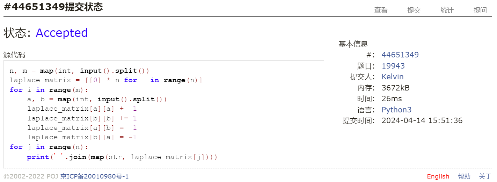
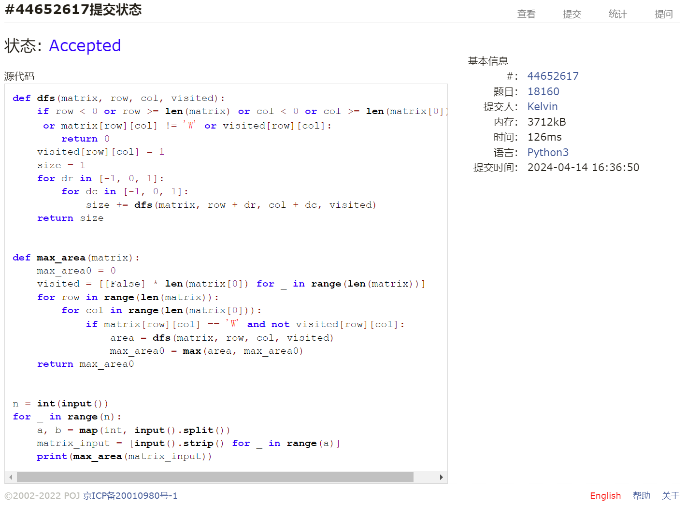
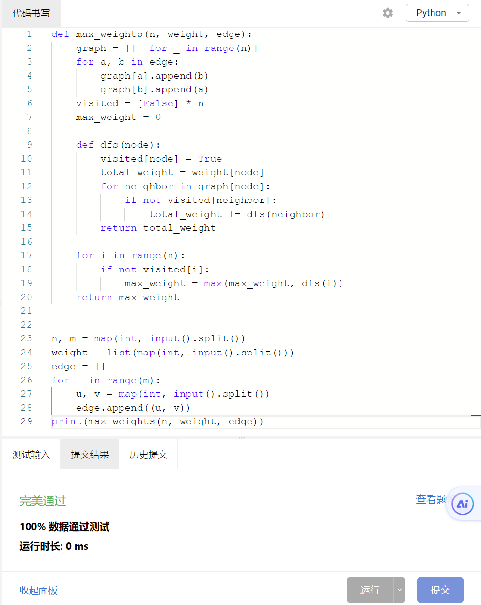
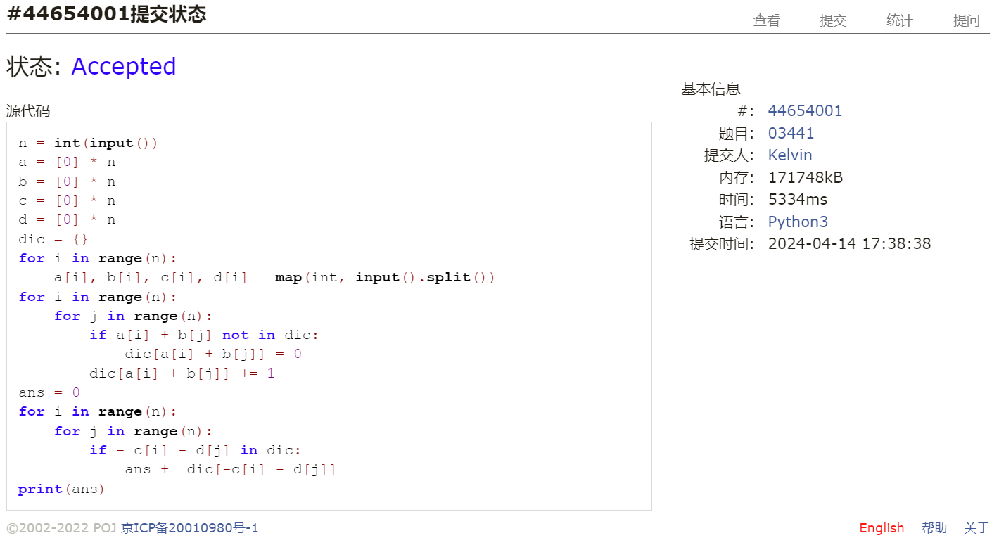
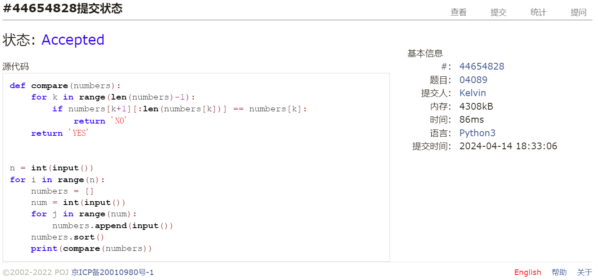
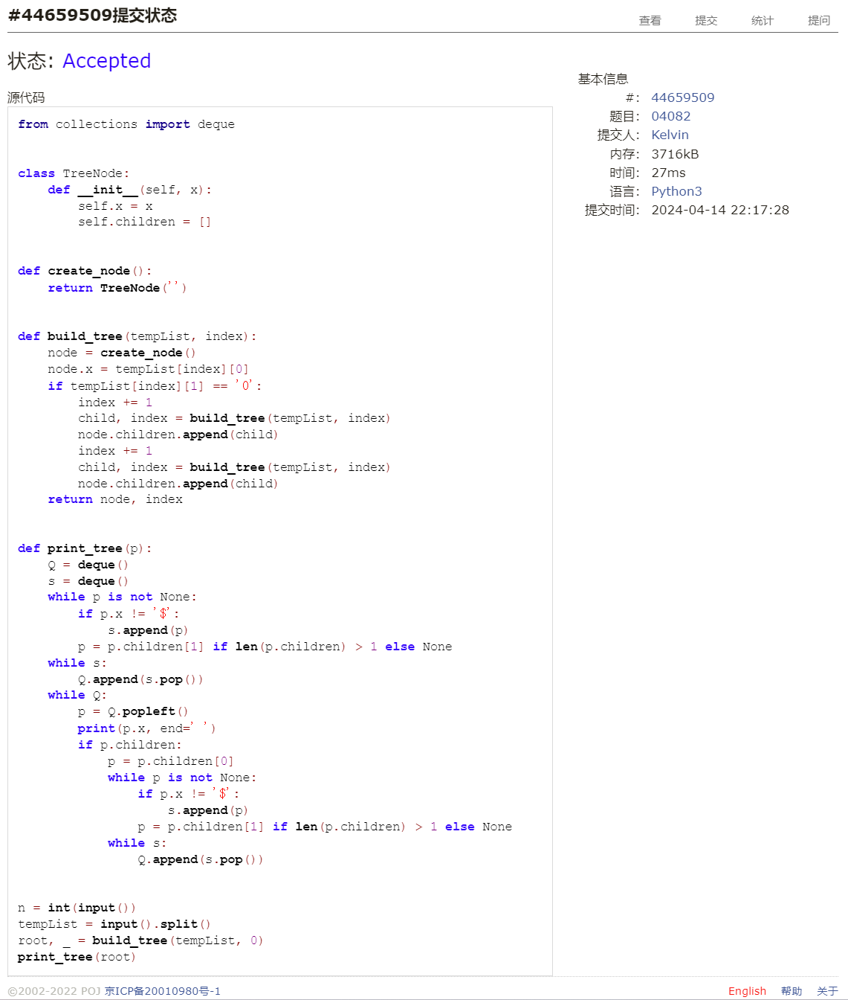

# Assignment #8: 图论：概念、遍历，及 树算

Updated GMT+8 April 14, 2024

2024 spring, Complied by 钟俊宇 物理学院

**编程环境**

==Windows 11 家庭中文版, PyCharm Community Edition 2023.3.3==


## 1. 题目

### 19943: 图的拉普拉斯矩阵

matrices, http://cs101.openjudge.cn/practice/19943/

思路：

可直接计算出拉普拉斯矩阵元的值

代码

```python
# 
n, m = map(int, input().split())
laplace_matrix = [[0] * n for _ in range(n)]
for i in range(m):
    a, b = map(int, input().split())
    laplace_matrix[a][a] += 1
    laplace_matrix[b][b] += 1
    laplace_matrix[a][b] = -1
    laplace_matrix[b][a] = -1
for j in range(n):
    print(' '.join(map(str, laplace_matrix[j])))
```

代码运行截图 ==（至少包含有"Accepted"）==



### 18160: 最大连通域面积

matrix/dfs similar, http://cs101.openjudge.cn/practice/18160

思路：

使用深度优先搜索计算出每个连通域的面积，求其最大值

代码

```python
# 
def dfs(matrix, row, col, visited):
    if row < 0 or row >= len(matrix) or col < 0 or col >= len(matrix[0]) \
     or matrix[row][col] != 'W' or visited[row][col]:
        return 0
    visited[row][col] = 1
    size = 1
    for dr in [-1, 0, 1]:
        for dc in [-1, 0, 1]:
            size += dfs(matrix, row + dr, col + dc, visited)
    return size


def max_area(matrix):
    max_area0 = 0
    visited = [[False] * len(matrix[0]) for _ in range(len(matrix))]
    for row in range(len(matrix)):
        for col in range(len(matrix[0])):
            if matrix[row][col] == 'W' and not visited[row][col]:
                area = dfs(matrix, row, col, visited)
                max_area0 = max(area, max_area0)
    return max_area0


n = int(input())
for _ in range(n):
    a, b = map(int, input().split())
    matrix_input = [input().strip() for _ in range(a)]
    print(max_area(matrix_input))
```

代码运行截图 ==（至少包含有"Accepted"）==



### sy383: 最大权值连通块

https://sunnywhy.com/sfbj/10/3/383

思路：

与上一题相似，使用深度优先搜索，区别在于使用列表而非矩阵

代码

```python
# 
def max_weights(n, weight, edge):
    graph = [[] for _ in range(n)]
    for a, b in edge:
        graph[a].append(b)
        graph[b].append(a)
    visited = [False] * n
    max_weight = 0

    def dfs(node):
        visited[node] = True
        total_weight = weight[node]
        for neighbor in graph[node]:
            if not visited[neighbor]:
                total_weight += dfs(neighbor)
        return total_weight

    for i in range(n):
        if not visited[i]:
            max_weight = max(max_weight, dfs(i))
    return max_weight


n, m = map(int, input().split())
weight = list(map(int, input().split()))
edge = []
for _ in range(m):
    u, v = map(int, input().split())
    edge.append((u, v))
print(max_weights(n, weight, edge))
```

代码运行截图 ==（AC代码截图，至少包含有"Accepted"）==



### 03441: 4 Values whose Sum is 0

data structure/binary search, http://cs101.openjudge.cn/practice/03441

思路：

使用字典大幅缩减时间

代码

```python
# 
n = int(input())
a = [0] * n
b = [0] * n
c = [0] * n
d = [0] * n
dic = {}
for i in range(n):
    a[i], b[i], c[i], d[i] = map(int, input().split())
for i in range(n):
    for j in range(n):
        if a[i] + b[j] not in dic:
            dic[a[i] + b[j]] = 0
        dic[a[i] + b[j]] += 1
ans = 0
for i in range(n):
    for j in range(n):
        if - c[i] - d[j] in dic:
            ans += dic[-c[i] - d[j]]
print(ans)
```

代码运行截图 ==（AC代码截图，至少包含有"Accepted"）==



### 04089: 电话号码

trie, http://cs101.openjudge.cn/practice/04089/

思路：

不用Trie，直接对电话号码进行排序后比较，若一个电话号码是另一个的前缀，则二者必相邻

代码

```python
# 
def compare(numbers):
    for k in range(len(numbers)-1):
        if numbers[k+1][:len(numbers[k])] == numbers[k]:
            return 'NO'
    return 'YES'


n = int(input())
for i in range(n):
    numbers = []
    num = int(input())
    for j in range(num):
        numbers.append(input())
    numbers.sort()
    print(compare(numbers))
```

代码运行截图 ==（AC代码截图，至少包含有"Accepted"）==



### 04082: 树的镜面映射

http://cs101.openjudge.cn/practice/04082/

思路：

递归的构建树，注意到每个伪满二叉树节点的左节点一定是子节点，右节点一定是兄弟节点。构建树之后按照先兄弟后儿子输出

代码

```python
# 
from collections import deque


class TreeNode:
    def __init__(self, x):
        self.x = x
        self.children = []


def create_node():
    return TreeNode('')


def build_tree(tempList, index):
    node = create_node()
    node.x = tempList[index][0]
    if tempList[index][1] == '0':
        index += 1
        child, index = build_tree(tempList, index)
        node.children.append(child)
        index += 1
        child, index = build_tree(tempList, index)
        node.children.append(child)
    return node, index


def print_tree(p):
    Q = deque()
    s = deque()
    while p is not None:
        if p.x != '$':
            s.append(p)
        p = p.children[1] if len(p.children) > 1 else None
    while s:
        Q.append(s.pop())
    while Q:
        p = Q.popleft()
        print(p.x, end=' ')
        if p.children:
            p = p.children[0]
            while p is not None:
                if p.x != '$':
                    s.append(p)
                p = p.children[1] if len(p.children) > 1 else None
            while s:
                Q.append(s.pop())


n = int(input())
tempList = input().split()
root, _ = build_tree(tempList, 0)
print_tree(root)
```

代码运行截图 ==（AC代码截图，至少包含有"Accepted"）==



## 2. 学习总结和收获

本次题目对我而言难度较大，部分题目需要照着题解才能写出，对深度优先搜索和广度优先搜索算法有了初步的理解，后续还要多巩固。


