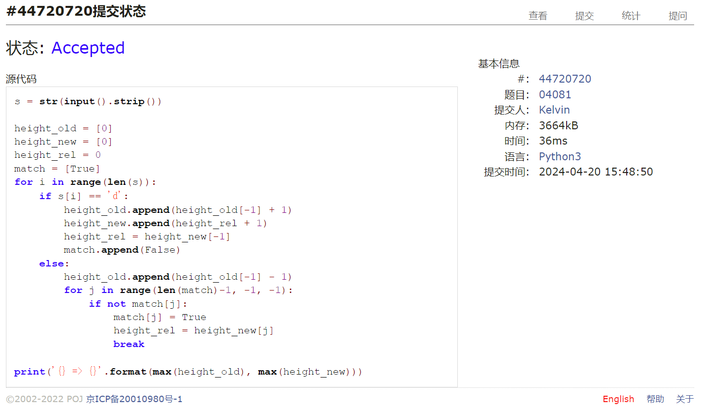
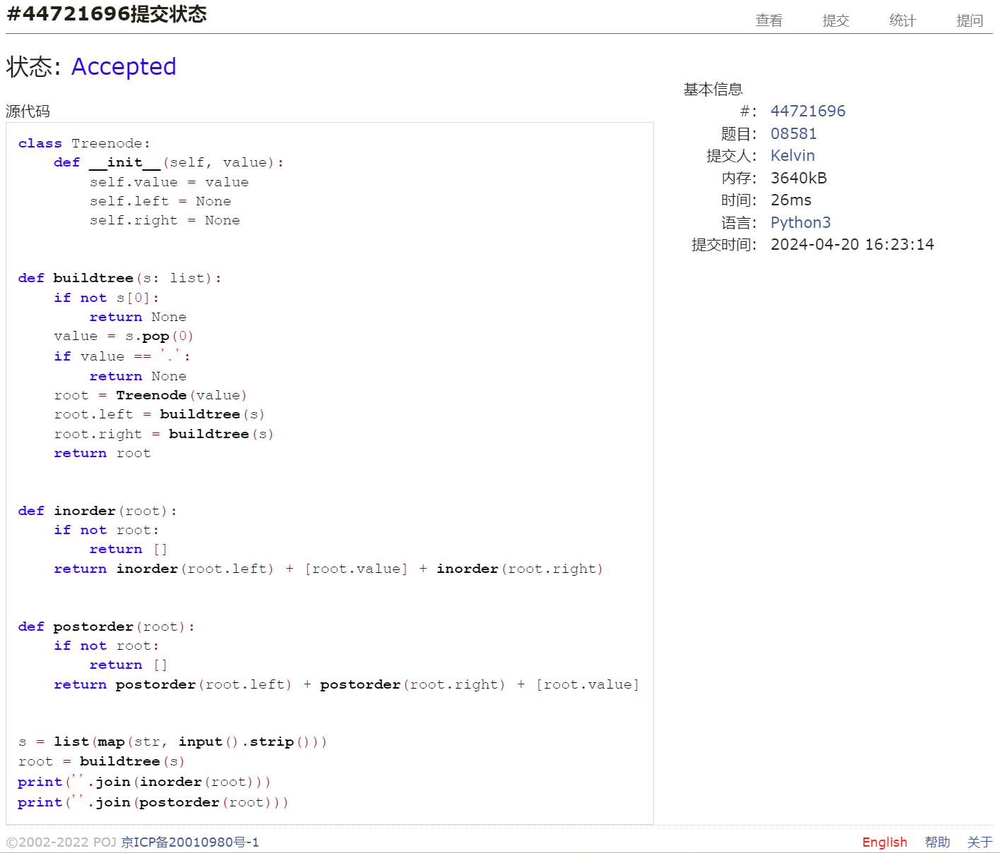
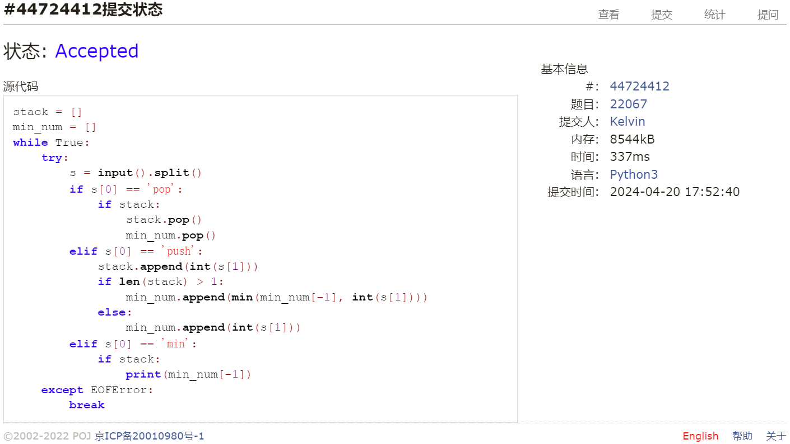
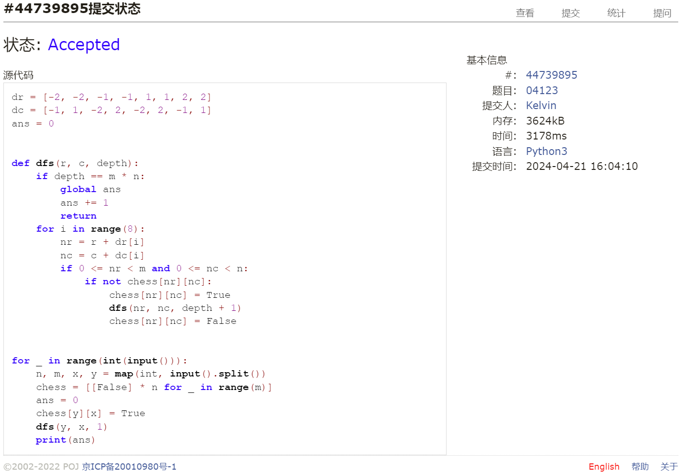

# Assignment #9: 图论：遍历，及 树算

Updated GMT+8 April 20, 2024

2024 spring, Complied by 钟俊宇 物理学院

**编程环境**

==Windows 11 家庭中文版, PyCharm Community Edition 2023.3.3==

## 1. 题目

### 04081: 树的转换

http://cs101.openjudge.cn/dsapre/04081/

思路：

转换前树的高度：遍历输入字符串，遇到d则结点高度+1，遇到u则结点高度-1，树的高度为遍历过程中结点高度的最大值
转换后树的高度：遍历输入字符串，将出现的d和u进行匹配，每一个d对应结点的高度是上一个u匹配的d对应结点的高度+1，树的高度为遍历过程中结点高度的最大值

代码

```python
# 
s = str(input().strip())

height_old = [0]
height_new = [0]
height_rel = 0
match = [True]
for i in range(len(s)):
    if s[i] == 'd':
        height_old.append(height_old[-1] + 1)
        height_new.append(height_rel + 1)
        height_rel = height_new[-1]
        match.append(False)
    else:
        height_old.append(height_old[-1] - 1)
        for j in range(len(match)-1, -1, -1):
            if not match[j]:
                match[j] = True
                height_rel = height_new[j]
                break

print('{} => {}'.format(max(height_old), max(height_new)))
```

代码运行截图 ==（至少包含有"Accepted"）==



### 08581: 扩展二叉树

http://cs101.openjudge.cn/dsapre/08581/


思路：

由于二叉树的空结点都用.补齐了，直接进行递归就可以得到唯一确定的树。

代码

```python
# 
class Treenode:
    def __init__(self, value):
        self.value = value
        self.left = None
        self.right = None


def buildtree(s: list):
    if not s[0]:
        return None
    value = s.pop(0)
    if value == '.':
        return None
    root = Treenode(value)
    root.left = buildtree(s)
    root.right = buildtree(s)
    return root


def inorder(root):
    if not root:
        return []
    return inorder(root.left) + [root.value] + inorder(root.right)


def postorder(root):
    if not root:
        return []
    return postorder(root.left) + postorder(root.right) + [root.value]


s = list(map(str, input().strip()))
root = buildtree(s)
print(''.join(inorder(root)))
print(''.join(postorder(root)))
```

代码运行截图 ==（至少包含有"Accepted"）==



### 22067: 快速堆猪

http://cs101.openjudge.cn/practice/22067/


思路：

建一个存储猪体重的列表1，再建一个存储最小猪体重的列表2（列表2的第k个元素是列表1的前k个元素的最小值，即前k只猪的最小体重）。
pop和push操作同时对两个列表进行，push操作简化为比较列表2末端元素和新增元素的大小并存储较小的元素；min操作简化为输出列表2的末端元素。

代码

```python
# 
stack = []
min_num = []
while True:
    try:
        s = input().split()
        if s[0] == 'pop':
            if stack:
                stack.pop()
                min_num.pop()
        elif s[0] == 'push':
            stack.append(int(s[1]))
            if len(stack) > 1:
                min_num.append(min(min_num[-1], int(s[1])))
            else:
                min_num.append(int(s[1]))
        elif s[0] == 'min':
            if stack:
                print(min_num[-1])
    except EOFError:
        break
```

代码运行截图 ==（AC代码截图，至少包含有"Accepted"）==



### 04123: 马走日

dfs, http://cs101.openjudge.cn/practice/04123

思路：

使用dfs算法，从给定起点进行遍历，将访问过的节点进行标记，当深度与棋盘总格子数相等时视为找到了一条遍历路径，使用回溯得到所有可能的路径。

代码
```python
# 
dr = [-2, -2, -1, -1, 1, 1, 2, 2]
dc = [-1, 1, -2, 2, -2, 2, -1, 1]
ans = 0


def dfs(r, c, depth):
    if depth == m * n:
        global ans
        ans += 1
        return
    for i in range(8):
        nr = r + dr[i]
        nc = c + dc[i]
        if 0 <= nr < m and 0 <= nc < n:
            if not chess[nr][nc]:
                chess[nr][nc] = True
                dfs(nr, nc, depth + 1)
                chess[nr][nc] = False


for _ in range(int(input())):
    n, m, x, y = map(int, input().split())
    chess = [[False] * n for _ in range(m)]
    ans = 0
    chess[y][x] = True
    dfs(y, x, 1)
    print(ans)

```

代码运行截图 ==（AC代码截图，至少包含有"Accepted"）==



### 28046: 词梯

bfs, http://cs101.openjudge.cn/practice/28046/

思路：


代码

```python
# 

```


代码运行截图 ==（AC代码截图，至少包含有"Accepted"）==


### 28050: 骑士周游

dfs, http://cs101.openjudge.cn/practice/28050/


思路：


代码

```python
# 

```


代码运行截图 ==（AC代码截图，至少包含有"Accepted"）==


## 2. 学习总结和收获

前四题还好，后两题只能看着答案的代码来写，正在努力领悟中T_T


